<page-title/>
 
Web API設計ガイドラインは、世の中のシステム開発プロジェクトのために無償で提供致します。

ただし、掲載内容および利用に際して発生した問題、それに伴う損害については、フューチャー株式会社は一切の責務を負わないものとします。

また、掲載している情報は予告なく変更することがございますので、あらかじめご了承下さい。

# はじめに

本規約はWeb APIを利用する開発者向けに、RESTライクなWeb APIの主な設計手法をまとめ、システム開発プロジェクトにおける設計のベースラインを提供するために作成された。本規約を用いることで、開発チームは何を設計すべきか、どのような判断を下すべきかについて共通認識を得ることができる。また、設計の属人性を軽減させ、ナレッジやツールの横展開を容易にすることを狙いにしている。

# 前提条件

規約の作成にあたってWeb APIは次の前提を持つとする。

- gRPC、JSON-RPC、SOAP、GraphQLなど、RPCやグラフ志向ではなく、REST志向のWeb APIを構築が対象である
- 業務システム向け Web API 提供である（サードパーティ向けに広く開発する Web API ではなく、限られたクライアントやシステムと連携すること。いわゆる、LSUDs（Large Set of Unknown Developers）ではなく、SSKDs（Small Set of Known Developers）が対象である
- AWSなどのクラウド環境で構築される

また、利用者は以下の技術を理解しているとし、本規約ではこれらについて解説はしない。

- 基礎的なHTTPの知識
- 基礎的なRESTの知識

# 適用範囲

Web APIのサーバサイドの設計についてまとめる。クライアントサイドについては対象外とする。  
また、OpenAPI Specificationについては、[OpenAPI Specification 3.0.3規約](https://future-architect.github.io/coding-standards/documents/forOpenAPISpecification/OpenAPI_Specification_3.0.3.html) を参考にすること。

# 免責事項

::: tip 有志で作成したドキュメントである  
フューチャーアーキテクトには多くの部署や多様なプロジェクトが存在し、それぞれの状況に合わせて創意工夫された設計ポリシーが存在する。本規約はフューチャーアーキテクトの全ての部署／プロジェクトで利用されているわけではなく、有志が観点を持ち寄って新たに整理したものである。相容れない部分があればその領域を書き換えて利用することを想定している  
:::

# スタイル

各要素ごとのWeb APIの表記は以下のルールとする。表記形式を統一することで設計時の考慮事項や、Web API利用時のミスを減らすことを目的とする。

| 対象                       | 推奨                | 例                 | 理由                                                                                                                                                                                          |
| :------------------------- | :------------------ | :----------------- | :-------------------------------------------------------------------------------------------------------------------------------------------------------------------------------------------- |
| ホスト名                   | kebab-case          | api.example.com    | ホスト名にはアンダースコア（\_)の使用をRFC 952、RFC 1123では許容していない。RFC1123では大文字と小文字を区別しなくても良いとあるため。必然的に文字の区切りはハイフンであるkebab-caseを利用する |
| パス（リソース名）         | kebab-case \+複数形 | delivery-schedules | ホスト名がkebab-caseであるため、それと整合性を取る。 また、REST志向という前提であるため、リソース名の最後は複数形にする                                                                       |
| リクエストヘッダ           | kebab-case          | x-debug-enabled    | ※1                                                                                                                                                                                            |
| クエリパラメータ           | snake_case          | order_id           |                                                                                                                                                                                               |
| リクエストボディのJSON項目 | snake_case          | order_id           | ※2                                                                                                                                                                                            |
| レスポンスヘッダ           | kebab-case          | x-debug-logs       | ※1                                                                                                                                                                                            |
| レスポンスボディのJSON項目 | snake_case          | order_id           |                                                                                                                                                                                               |

※1 ヘッダーフィールドについて

[RFC 7540: Hypertext Transfer Protocol Version 2 (HTTP/2)](https://www.rfc-editor.org/rfc/rfc7540#section-8.1.2) によると、以下が記載されている。

- ヘッダーフィールドは大文字／小文字を区別しない（case-insensitive）
- HTTP/2にエンコーディングする前に、ヘッダーフィールドを小文字に変換する必要がある

また、 [HTTP ヘッダー \- HTTP | MDN](https://developer.mozilla.org/ja/docs/Web/HTTP/Headers) に記載の通り、以前は X- 接頭辞を使用していたが、この慣習は、標準外のフィールドが標準になったときに不便が発生するため、2012 年 6 月の RFC 6648（[日本語訳](https://tex2e.github.io/rfc-translater/html/rfc6648.html)） で非推奨になった。ただし、プライベートなWeb APIでは標準化されることはまずないので、区別をわかりやすくするため明示的に `x-` のプレフィックスを付与する。

※2 JSONフィールドの命名規則

JavaScriptでの扱いを考えると、camelCaseの方が親和性が高いという考えもある。現代のフロントエンドのエコシステムを考えると、例えばZodなどのライブラリを使用する前提で、容易に変換可能であるため、snake_caseとする。

```js
// 要求例
https://api.example.com/delivery-schedules?order_id=12345
```

```js
// 応答例
{
  "order_id": "12345",
  "delivery_schedules": [
    {
      "schedule_id": "67890",
      "status": "shipped",
      "estimated_delivery_date": "2023-10-10",
      "carrier": "Delivery Service Provider Name",
      "tracking_number": "TRACK1234567890",
      "delivery_address": {...}
    },
    {
      "schedule_id": "67891",
      "status": "in transit",
      "estimated_delivery_date": "2023-10-12",
      "carrier": "Another Delivery Service Provider",
      "tracking_number": "TRACK0987654321",
      "delivery_address": {...}
    }
  ]
}
```

参考: [HTTPヘッダーのX-は非推奨と言うけれど・・・](https://zenn.dev/ys/articles/a58b02e3cbc2f839f7f1)

# ホスティング戦略

## サブドメインとサブパス

Web APIのホスティング戦略とは、Web APIのエンドポイントをどのように配置し、アクセス可能にするかを決定するための方針や方法を指す。大きく以下の方式が存在する。

|          | 1.サブドメイン方式                                                        | 2.サブパス方式                                                                                               |
| :------- | :------------------------------------------------------------------------ | :----------------------------------------------------------------------------------------------------------- |
| 例       | `api.example.com`                                                         | `example.com/api`                                                                                            |
| 説明     | WebサイトとAPIが明確に分離でき、独立したAPIサービスを提供するときに適する | 同一ドメインで静的コンテンツもWeb APIを配信する際に利用する。画面とWeb APIの両方作る場合に採用することが多い |
| DNS管理  | 追加する                                                                  | メインのドメインと共用                                                                                       |
| CORS設定 | 必要                                                                      | 不要                                                                                                         |

本規約の推奨は以下の通り。

- 同一ドメインで静的コンテンツ（HTML/CSS/JavaScript/画像など）を配信するか、配信する予定があるのであれば、 サブパス方式を利用する
- APIサービスを独立して提供する想定であれば、`api.example.com` といったサブドメインを採用する。この際は `/api` は不要とする

## マイクロサービス時の振り分け

マイクロサービス構成で、fooサービス、barサービスが存在するなどで複数のWeb APIを提供する場合に、どのようにエンドポイントを提供するかについても、同様にサブドメイン方式／サブパス方式のどちらを採用するか決める必要がある。

|                      | 1.サブドメイン方式                        | 2.サブパス方式                            |
| :------------------- | :---------------------------------------- | :---------------------------------------- |
| 凡例                 | `api.{サービス名}.example.com`            | `example.com/api/{サービス名}`            |
| 具体例               | `api.foo.example.com api.bar.example.com` | `example.com/api/foo example.com/api/bar` |
| パス例               | `GET api.foo.example.com/v1/articles/123` | `GET example.com/api/foo/v1/articles/123` |
| DNS管理              | 追加する                                  | メインのドメインと共用                    |
| CORS設定             | 必要                                      | 不要                                      |
| Cookie認証実施の場合 | APIごとに必要                             | どれか1つの認証で事足りる                 |

本規約の推奨は以下の通り。

- 各マイクロサービスの独立性を高める考えであれば、「1.サブドメイン方式」で提供する
- サービスの粒度管理や、認証などの観点から、サブパスで提供する場合は、`/api/{サービス名}` のパス形式を採用する
- APIゲートウェイで集約して提供する場合は、「2.サブパス方式」を採用する

# リソース表現

例えば、記事に対するコメントを表現するにはリソースをネストさせるか、フラットにするかという設計判断が存在する。

1. `/articles/1/comments/1` （ネスト）
2. `/comments/1` （フラット）

それぞれの特徴をまとめる。

|                             | 1.ネスト表現                                                                   | 2.フラット表現                                                   |
| :-------------------------- | :----------------------------------------------------------------------------- | :--------------------------------------------------------------- |
| 説明                        | コメントが特定の記事に紐づくことが明示的にできる                               | コメントというリソースの独立性を重視する場合に適している         |
| コメント一覧の取得          | `GET /articles/1/comments` で取得                                              | `GET /comments?article_id=1` で取得                              |
| コメントの削除              | `DELETE /articles/1/comments/1 article_id` も必須項目である                    | `DELETE /comments/1` article_id無しで削除可                      |
| コメント追加                | `POST /articles/1/comments`                                                    | `POST /comments` リクエストボディにarticle_idの指定が必要        |
| DELETE /articles/1 時の挙動 | 紐づいたコメントも消えることが直感的                                           | 記事に関連したコメントが消えることは必ずしも直感的ではない       |
| まとめ                      | 親リソースに関連性が深い（一覧参照、削除時にカスケード削除される場合に適する） | 他のリソースと親子関係に無い、独立したリソースである場合に適する |

本規約の推奨は以下の通り。

- 【GET】親リソースに紐づいた子リソースを一覧検索で取得する可能性がある場合は、ネスト表現を採用する
- 【POST】親リソースの配下にリソースを作成するのであれば、ネスト表現を採用する
- 【DELETE】親リソースが削除された場合に、同時に子リソースも削除すべきであれば、ネスト表現を採用する
- ネスト／フラットの両方を使い分けることはありえるが、両方のサポートは最小限とする

例示の記事に対するコメントであれば、記事が削除された場合にコメントも合わせて削除することが自然であれば、1のネスト表現を採用する。もし、依存する親リソースがなく、独立しているのであれば、2のフラット表現を採用する。

ネスト表現／フラット表現が混ざることは自然である。また、ネスト／フラットの両方をサポートするパターンもある。両方サポートする場合は、開発の手間が増えてしまうが利用者側のユースケースが見えない場合に使える。保守運用コストが増えるため、ネスト／フラット両方のサポートはなるべく減らすことが望ましい。

以下に受注の例を上げる。

- ネストのみで提供
  - 【POST】/customers/{customer_id}/orders 受注の作成
  - 【GET】/customers/{customer_id}/orders 取引先に紐づいた受注の検索
- フラットのみで提供
  - 【PUT】/orders/{order_id} 受注情報の編集
  - 【DELETE】/orders/{order_id} 受注の取り消し
- 両方で提供
  - 【GET】/orders/{order_id} 受注情報の取得
  - 【GET】/customers/{customer_id}/orders/{order_id} 本来不要にしても良いが、開発者体験のためにサポート

上記例では、以下を強調するためにネスト／フラットを混在させている。

- 受注の作成は取引先が必須
- 受注は取引先とのやり取りが停止になっても、受注情報は残るため、リソースが独立的である旨を示す

# APIバージョニング

破壊的変更を伴うアップデートを伴う場合、整合性を保ってAPI利用者に切り替えを強制できる場合は良いが、そうでない場合は複数のバージョンを並行して提供するという、切り替え期間を持つ必要がでてくる。その時、バージョン番号をAPI利用者に何かしらの方法でバージョンを指定してもらう必要がある。

## バージョンニング方式

バージョンの表現方法として、以下の3パターンが考えられる。

それぞれメリット/デメリットがあるが、本来のREST思想とのギャップがあるものの実用の観点から「1.パスベースを推奨する）

| 評価観点                     | 1.パス方式 ※推奨                        | 2.HTTPヘッダ方式                                            | 3.サブドメイン方式                 |
| :--------------------------- | :-------------------------------------- | :---------------------------------------------------------- | :--------------------------------- |
| 説明                         | URIの一部にバージョン情報を付与する方法 | リクエストヘッダにバージョン情報を付与する方法              | ドメインで切り替える方法           |
| 例                           | `/v2/users/a5811`                       | `Accept: application/vnd/example.v2+json`                   | `v2.example.com`                   |
| REST思想との相性             | ⚠️良くない                              | ✅️                                                         | ✅️                                |
| openapi.yamlスキーマ管理     | ✅️                                     | ⚠️（レスポンス項目が異なる場合、定義しにくい）              | ❌️（別ファイルとして管理）        |
| openapi.yamlコード生成       | ✅️                                     | ⚠️（レスポンス項目が異なる場合、定義しにくい）              | ✅️（定義ファイル毎に生成）        |
| ロードバランサー対応         | ✅️                                     | ✅️                                                         | ✅️                                |
| バージョン指定のわかりやすさ | ✅️                                     | ✅️                                                         | ✅️                                |
| インフラ構成の複雑度         | ✅️                                     | ✅️                                                         | ⚠️（サブドメイン追加の作業が必要） |
| ログ                         | ✅️バージョン番号もログに残りやすい     | ❌️ヘッダも出力しないとどのバージョンを使ったかわかりにくい | ✅️フルパスを出せば残る            |

## 後方互換性

本規約の推奨は以下の通り。

- Web APIは基本的に、なるべく「後方互換性」を維持するように機能改修する
- 後方互換性を破壊する改修が必要で、クライアントへ移行期間の提供が必須な場合は、メジャーバージョンを上げて複数バージョンを一時的に提供する

後方互換性を保った機能改修例:

- 新規に任意属性のクエリパラメータを追加する
- レスポンスボディのJSON項目を追加する

後方互換性を破壊する機能改修例:

- リソースパスの変更（例えば、`/users/123` を `/customers/123` に変更する）
- 過去のバージョンで利用可能だったクエリパラメータの1つ以上の廃止
- レスポンスから、あるJSON項目を削除、あるいは名称を変更する
- ユーザ影響があるような、APIの振る舞いを変更する（例えば、同期でリソースを作成していたのが非同期になる）

なお、API内部の振る舞いの変更には、バグ修正も正確には含まれるが、これは後方互換性の破壊には通常含めない。ただし、バグに依存した形でクライアントが実装されている場合は、個別調整するかメジャーバージョンを上げる。

## バージョン戦略

後方互換性のある改修のうち、パッチバージョンアップやマイナーバージョンアップと呼ばれるような改修には以下がある。

| 項目                     | 改修例                                                              |
| :----------------------- | :------------------------------------------------------------------ |
| パッチバージョンアップ   | ・小さなバグ修正 ・エラーメッセージのtypo修正 ・APIドキュメント修正 |
| マイナーバージョンアップ | ・新しいオプションが追加 ・性能改善、セキュリティ強化など           |

本規約の推奨は以下の通り。

- 後方互換性が無い改修が行われた場合は、メジャーバージョンアップを行う
- Web APIの機能単位のバージョン管理の粒度は、メジャーバージョン粒度とする
  - `/api/v1/foo` `/api/v2/foo`
  - `/api/v1.1/foo` `/api/v1.2/foo` といったマイナーバージョン粒度の管理は、費用対効果の観点から行わない
- v2、v3などのバージョン追加は通常管理コストが大きいため、できる限り採用しない
  - 例えば、内部の振る舞いを多少変更する程度あれば、任意のオプションを追加して切り替え可能とする
  - OpenAPI定義上、スキーマが大きく変わるようであればバージョンを上げて分離する

::: tip  
ソースコードはセマンティック バージョニング x.y.z で管理することが多いと考えられる。各APIのバージョン（v1、v2など）と、ソースコードのバージョン（1.2.1など）は一致せず、全く別のライフサイクルで管理する。  
:::

## APIの廃止

将来的なWeb APIの廃止予定が決まった場合、OpenAPI定義としては、 `deprecated:true` で表明することができる。

```yaml
openapi: 3.0.3
info:
  title: Order API
  version: 1.0.0
paths:
  /v1/orders/{order_id}:
    get:
      summary: 受注情報の取得（※⚠️2025年●月に廃止予定）
      tags:
        - 受注
      deprecated: true # 廃止予定
      parameters:
        - name: order_id
          in: path
          required: true
          schema:
            type: string
      responses:
        "200":
          description: Successful response
```

これによりSwagger UIにより、ドキュメント上も廃止予定の旨が明示的に表現される。


Web APIの応答には、RFC 8594 \- Sunset HTTPヘッダーフィールド（[日本語訳](https://tex2e.github.io/rfc-translater/html/rfc8594.html)）にあるように、非推奨の提示ができる。RFC 8594はInformationalであり標準ではないが、抑えておくべき内容である。

以下に /v1/orders/{order_id} が廃止予定になった場合の応答例を示す。

```json
HTTP/1.1 200 OK
Content-Type: application/json
Deprecation: true
Sunset: Sat, 30 Sep 2025 00:00:00 GMT
Link: <https://api.example.com/v2/orders/{order_id}>; rel="alternate"

{
  "order_id": "12345",
  "order_date": "2023-09-30T00:00:00Z",
  "order_amount": 15000,
}
```

- Deprecation
  - trueで廃止予定になったことを示す
- Sunset
  - 廃止予定の年月日を示す。特に無くても良い
- Link
  - 代替先のURLを提示。オプションである

本規約の推奨は以下の通り。

- プライベートAPIの廃止は影響度調査を実施し、周知および調整を行う
- 同時に、OpenAPI定義にdeprecated設定する
- レスポンスヘッダのDeprecationヘッダをtrueにする
  - Sunset, Linkは任意で設定する
- クライアントは、Deprecationヘッダがtrueの場合、WARNログを出すようにするなどの周知を予め行う

実際に廃止予定のAPIを削除する際には、アクセスログなどから利用実績を確認の上で行う。

参考: [URLリソースの非推奨を示すDeprecationヘッダ \- ASnoKaze blog](https://asnokaze.hatenablog.com/entry/2020/12/27/233402)

# HTTPメソッド

## 利用方針

HTTPリクエストメソッドは[RFC 7231](https://datatracker.ietf.org/doc/html/rfc7231#section-4.3)および[RFC 5789](https://datatracker.ietf.org/doc/html/rfc5789#section-2)で定義されている。業務においてアプリケーションで使用するメソッドは以下の通りとする。CONNECT、OPTIONS、TRACEには言及しない。

| メソッド | 副作用 | 冪等性 | 説明                                                                                                                                                |
| :------- | :----- | :----- | :-------------------------------------------------------------------------------------------------------------------------------------------------- |
| HEAD     | ✅️    | ✅️    | ヘッダー取得。GETと異なりレスポンスボディを取得しない                                                                                               |
| GET      | ✅️    | ✅️    | 参照                                                                                                                                                |
| POST     | ❌️    | ❌️    | リソース作成／更新／追加。非同期要求の場合も利用する。複雑な検索条件を指定する場合には、リクエストボディに記載しPOSTを利用するケースがある（※後述） |
| PUT      | ❌️    | ✅️    | リクエストボディによってリソースを作成、または置き換える。リソースの新規作成もサポートするケースがあるが、本規約では原則禁止とする（※後述）         |
| PATCH    | ❌️    | ⚠️     | 指定された項目だけ部分的に更新する。リソースの新規作成をサポートする場合もあるが、本規約では禁止とする（※後述）                                     |
| DELETE   | ❌️    | ✅️    | リソースを削除する                                                                                                                                  |

## 複雑な検索条件が必要な場合にPOSTを用いてよいか

参照は基本的にGETメソッドを用いる。理由は以下の通り。

- キャッシュが効く
- ブックマークでき、リンクとして共有できる利便性が高いため

しかし、次の場合はPOSTを使用することを検討する。

- クエリパラメータで表現することが難しい
  - 検索条件がネストしている
- バッチ的に複数の検索キーがあり、長大になりえる
  - IEの時代は2083文字が上限
  - 現在は[RFC 7230の仕様上、8000文字以上の制限](https://datatracker.ietf.org/doc/html/rfc7230#section-3.1.1)であることがHTTP実装に求められる
- URLに表示したくない、ログに書き出したくない値（秘匿情報、個人情報など）を指定したい場合
  - 暗号化することで緩和可能だが、通常、ログに出ること自体避けるべきである

以下の設計は避ける方針とする。

- GETでリクエストボディ（コンテンツ）にパラメータを指定する方法は採用しない
  - HTTPソフトウェアによって無視、拒否されうるため

::: tip QUERYメソッド  
新しいHTTPメソッド、QUERYメソッドの仕様が検討されている。もし仕様策定が進むと、POSTではなくQUERYを用いる方が適切となる。  
[新しいHTTPメソッド、QUERYメソッドの仕様 \- ASnoKaze blog](https://asnokaze.hatenablog.com/entry/2021/11/09/231858)  
:::

参考:

- [HTTP検索条件、GETにするか？POSTにするか？ | フューチャー技術ブログ](https://future-architect.github.io/articles/20210518a/)

## リソースの新規作成時にPOST・PUTのどちらを用いるか

PUTもリソースの作成を許容すると、POSTとの使い分けに悩む場合がある。

本規約における推奨は以下の通り。

1. 新規作成はPOSTを使用する
2. PUTでリソースを新規作成するかどうかは基本的には非推奨、理由があれば対応して良い
   - PUTの実装は、SQLの場合はUpdateをMergeにする必要があり手間
   - PUTの実装は、DynamoDBなどKVSの場合は登録／更新を区別しないほうが楽であるため、新規作成を許容しても良い

1の理由は以下の通り。

- POSTとPUTでは仕様上、冪等性に差があり、同じ作成を行うとしても挙動差異で混乱する可能性があるため
  - POSTは呼び出しの数だけリソースが作られるとすることが自然
  - PUTは呼び出しが複数回あっても冪等であるべき（1リソースが作成されるべき）
- 新規作成時に `PUT /users/123` した場合、 `123` は新規作成時に払い出されるIDであり、ユーザーが指定可能にすべきではないため
  - `123` を別途ID採番エンドポイントから取得して利用する設計も考えられるが、外部からリソースキーが指定できる設計はクライアントの誤操作に脆弱であるため推奨しない。「POSTとPATCHの冪等」を参照

## サブリソース指定のPUTとPATCHの使い分け

本規約の推奨は以下の通り。

- リソースの更新はPATCHよりPUTの利用をより推奨する
  - PUTで統一することで設計／開発工数を抑える方針とする
  - PATCHは実装方針は明確に決まっておらず（「PATCHによる部分更新」参考）、設計工数も必要となるため
- 下記の場合はPATCHの使用を検討する
  - クライアントがリソースの全量を持たない
  - 通信量を可能な限り減らしたい（例えば、あるカラムがtext型で大きなデータ量を保持するなどの場合）

参考:

- [冪等と安全に関する誤解 \- Qiita](https://qiita.com/KyojiOsada/items/9c8db9714a0c9c72823c)
- [Zalando RESTful API と イベントスキーマのガイドライン](https://restful-api-guidelines-ja.netlify.app/#http-requests)

## RESTで表現できないRPC的な操作の場合

以下のようにHTTPメソッドで表現できない処理を `customVerb` （カスタム メソッド）を表現する場合、以下の3種類の設計案が存在する。

|                    | 1.パス表現                            | 2.コロン                                                                   | 3.パラメータ                           |
| :----------------- | :------------------------------------ | :------------------------------------------------------------------------- | :------------------------------------- |
| 概要               | POST /drafts/{draft_id}/copy          | POST /drafts/{draft_id}:copy                                               | POST /drafts/{draft_id}?action=copy    |
| REST思想との一致性 | ⚠️/copyが何かという点が議論されやすい | ✅️書籍API Design Patternsで紹介されており、比較的業界で受け入れられている | ⚠️世の中に浸透している手法は存在しない |
| OpenAPIとの相性    | ✅️別のパスとして扱われる             | ✅️別のパスとして扱われる                                                  | ❌️記述が難しい                        |

本規約の推奨は以下の通り。

- できる限りHTTPメソッドで表現で対応するように務める
  - `batch` `copy` `move` `cancel` `undelete` などのHTTPメソッドでどうしても表現しにくかったり、パスが既存機能と重複する場合は、カスタムメソッドを導入する（後者は、1件登録の、`POST /orders` を作成したあと、後日バッチ登録を追加する場合に `POST /orders/batch` と区別するようなケースを指す）
- 「1.パス」での利用とする（REST思想としては議論を生みやすいが、開発／運用の実用面では課題になることが少ないため）
  - カスタムメソッド部分は、 `camelCase` で記載する
  - カスタムメソッドは、URLの最後の要素でのみ利用可能
  - カスタムメソッドで表現する場合、 `POST` メソッドを利用する

注意点は以下である。

- いったん、カスタムメソッドを許容すると、適用範囲が広くなってしまう傾向があるが、なるべく利用を抑える（例えば、 `POST /users/1/upgradePlan` が生まれる。これは `PUT /users/1/subscription` など、工夫次第でREST表現できる）

参考:

- [カスタム メソッド | Cloud API Design Guide | Google Cloud](https://cloud.google.com/apis/design/custom_methods?hl=ja)

## 全てPOSTメソッドに統一する設計判断

バックエンドがREST志向ではなく、RPCとして動作させた方が適切なケースがある。例えば以下のような条件がある。

- 業務担当者ごとに権限モデルが異なるため、GET操作のキャッシュが基本的に不可である
- 複雑なビジネスロジックの呼び出しなどの画面アクションが中心であり、URLによるリソース表現と概念的な差異が大きい
  - 例えば、URLで表現できる複数のリソースに対しての登録／更新／削除処理を、同一のDBトランザクションで実行しなければならないようなアクションの場合
- HTTPメソッドでの表現と、実際の操作に概念的な差異が大きい
  - 在庫引当、出庫指示、受払など、POST／PUTなど悩ましいアクションが多い場合

また、以下のようなチーム体制に起因する理由も考えられる。

- 開発～保守運用まで見据えた場合に、メンバーのスキルセットによって、設計の一貫性を保てない懸念がある場合
  - 例えば、POST /users/1/updateProfile といったエンドポイントを作成してしまう懸念があり、教育／レビュー体制／静的解析で防ぐことが難しいと考えられる場合

全てのシステムがREST志向に適する訳ではないので、条件に応じてJSON-RPCなどの採用を検討する。RESTに囚われすぎず、エンドポイントは `/api/bl001` `/rpc/bl001` などで表現、メソッドはPOSTに限定するなどの設計をしても良い。

派生形として、以下のような設計にしても良い。

亜種の設計案:

- 参照はGET、それ以外の副作用が発生する処理はPOST
- エンドポイントは /rpc/bl001 などで表現

メリットとしては、GETのみ一律DBのリードレプリカを参照させる仕組みにするなどが考えられる（※参照処理だが一次ワークテーブルに検索のための駆動表をインサートする場合は、POSTにする必要があるなど、デメリットもあるため総合的に判断する）。参照系と副作用系を分離すると、負荷テストのスクリプト準備などで助かる場合もある。

## 副作用のある操作をした場合にリソースを返すべきか

POST、PUT、PATCH、DELETEを呼び出した場合、そのエンティティの結果をレスポンスボディに含めるべきか否かが設計上の議論になることがある。一般論として以下の考え方が取られることも多い。

- POST、PUT、PATCHはリソースを返す
- DELETEは204(No Content) を返す

本規約の推奨は以下の通り。

- フロントエンド側の要件でリソースを応答した方が都合が良ければ返す
- フロントエンド側の要件で特に指定が無ければ、あえてエンティティを返す必要はない
  - フロントエンド側の実装が、更新処理の後、画面表示する際に再度GETをするパターンを取ることも多い。この場合はバックエンドの都合で決めて良い（≒開発工数を抑える方針を取るべき）
- 公開APIで不特定多数で利用される場合は、安全側に倒す意味でエンティティを返すことも検討する

## DELETEで204 No Content 以外を返すべきかどうか

削除対象の子リソースがカスケードされて削除された場合に、削除された件数などを応答すべきではないかという議論がある。

本規約の推奨は以下の通り。

- フロントエンド側の要件でリソースを応答した方が都合が良ければ返す
  - DELETEのレスポンスで「何個消えたよ」という情報が欲しいケースがあれば追加する
  - 確認画面で「何個消えるよ」を出したいだけであれば、GETで取得できる設計に留める
- もし、フロントエンド側の要件で何も無ければ204を返す
  - 振る舞いをシンプルにすることで設計／開発工数を抑える

## POSTとPATCHの冪等

Idempotency-Keyヘッダという[IETF Draft（2024年11月時点）](https://datatracker.ietf.org/doc/html/draft-ietf-httpapi-idempotency-key-header-05)があり、POSTやPATCHに冪等性を持たせる（例えば、同じリクエストが2回来たとしても重複で処理をしない性質を持たせること）について議論されている。2024年12月時点ではDraft 05。主なユースケースは、ペイメントなどで多重の引き落としが許容されない場合が考えられる。特にマイクロサービスなシステム構成は要求失敗時にリトライを行うことが一般的であるため、多重で処理が成功してしまわないように制御する必要がある。

本規約の推奨は以下の通り。

- POSTやPATCHであっても、リトライ時の重複起動に備えて、できる限り冪等な設計とする
- IETF Draftな状態であるが、`Idempotency-Key` を用いる
- キーにはフロントエンドでUUIDを採番して設定してもらう
- サーバサイドのDBには `Idempotency-Key` の値とペイロードのハッシュ値を格納するカラムを追加し、`Idempotency-Key` 側のカラムにユニーク制約を貼る
- サーバサイドは、`Idempotency-Key`が指定された場合、その値とペイロードのハッシュ値を突き合わせて、どちらの値も一致していれば処理済みとする
- `Idempotency-Key` が処理済みだが、ペイロードハッシュ値が異なる場合は、400エラーを返す（フロントエンド側で別のUUIDを発番してもらう）

::: tip  
ボタン連打などの対策に、業務アプリケーションのよくある設計の1つに以下のような設計があった。

1. フロントエンドで最初に採番APIを呼び出し一意となる値を採番
2. 要求IDといった形式で登録項目に追加し、DB側でプライマリーキー（ユニーク制約）にして、重複排除を行う

採番APIを利用する処理フローは、呼び出し元からすると覚えるべきことが増え、E2Eなどの手間も増えるため、採番APIの代わりにフロントエンド側でUUIDを発行する方式を推奨する。  
:::

参考:

- [Idempotent (べき等)](https://developer.mozilla.org/ja/docs/Glossary/Idempotent)
- [Idempotency-Key Headerの現状・仕様・実装の理解を助けるリソースまとめ](https://ohbarye.hatenablog.jp/entry/2021/09/06/idempotency-key-header-resources)
- [Idempotency-Keyヘッダによるマイクロサービスの冪等性の担保](https://www.m3tech.blog/entry/2023/12/15/110000)

## PATCHによる部分更新

PATCHメソッドはリソースの部分更新をサポートするが、どのような形式にするかはRFC 5789で決まっていない。一般的には以下の形式が考えられる。

| 観点     | JSON Patch                                       | JSON Merge Patch★推奨                                                                                                                             |
| :------- | :----------------------------------------------- | :------------------------------------------------------------------------------------------------------------------------------------------------ |
| 説明     | RFC 6902。操作が明確に定義でき、細かい制御が得意 | RFC 7386。シンプルな構文で、元のJSONに対して新しい値を上書きするだけのため、直感的である。                                                        |
| 主な制約 | ・フォーマットがやや複雑で学習コストが必要       | ・配列のある要素だけ更新といった高度な操作はできない ・フィールドの削除をnullで表現するため、nullの値を持つことができる場合は、仕様通りにならない |

以下に `PATCH /users/123` する場合に以下の操作を行った場合のリクエスト例を上げる。

操作内容:

1. 名前を "John Smith" に変更
2. メールアドレスを "john.smith@example.com" に変更
3. 自宅電話番号を変更
4. 新しい住所フィールドを追加

JSON PATCH:

```js
[
  { op: "replace", path: "/name", value: "John Smith" },
  { op: "replace", path: "/email", value: "john.smith@example.com" },
  { op: "replace", path: "/phoneNumbers/0/number", value: "555-555-1234" },
  { op: "add", path: "/address/country", value: "USA" },
];
```

JSON Merge Patch:

```js
{
    "name": "John Smith",
    "email": "john.smith@example.com",
    "address": {
        "country": "USA",
    },
    "phoneNumbers": [
        {
            "type": "home", // 配列の要素のため、更新しない場合も元の要素を含める必要がある
            "number": "555-555-1234"
        }
    ]
}
```

本規約の推奨は以下の通り:

- PATCHのリクエストボディはJSON Merge Patch形式に従う
- JSON Merge Patchでハマりやすい、部分更新が出てきた場合は、PUTで処理できるエンドポイント設けるなど、PATCHにこだわりすぎない
- `null` が指定された場合、バックエンドがPostgreSQLなどRDBの場合はnull値に更新し、項目の削除はしてもしなくてもどちらでも良い。以降のレスポンスは項目ごと送信しないか、null値で送信するかは、これとは別の方針で決定する
- `Content-Type: application/merge-patch+json` で送信する。フレームワークなどの都合で対応できない場合は、 `Content-Type: application/json` も許容する

参考: [Web API 設計のベスト プラクティス \- Azure Architecture Center](https://learn.microsoft.com/ja-jp/azure/architecture/best-practices/api-design#patch-methods)

# クエリパラメータ

クエリーパラメータは以下のURLの `key1=value1\&key2=value2` にあたる要素を指す。

```sh
http://api.example.com:80/articles/123/comments?key1=value1&key2=value2
```

本規約で特記すべき推奨事項はない。以下の事項に注意して利用する。

- Web APIのURLはブラウザのアドレスバーに一般的に表示されないと考えられるが、第三者が一般ユーザーの開発者向けコンソールを開かせるといった攻撃も考えられる。そのため、クエリパラメータにはアクセストークンのような機密情報は載せず、HttpOnly属性を付けたCookieを利用する

## GET／HEAD以外でのクエリパラメータ

RFC 7231（[日本語訳](https://triple-underscore.github.io/RFC7231-ja.html)）の限り、POST／PUT／PATCH／DELETEでクエリパラメータを利用すること自体は禁止されているわけではない。

しかし、本規約の推奨は以下の通り。

- GET／HEAD以外のメソッドでのクエリパラメータの利用を原則禁止
- POST、PUT、PATCHの場合は、リクエストボディを利用する
- DELETEの場合は、原則パスパラメータで指定する
  - 楽観的ロックのlock_noだけは、クエリパラメータで指定可とする

理由は以下の通り。

- POST／PUT／PATCH／DELETEでのクエリパラメータの利用はあまり一般的ではない
- 設計が揺れる可能性がある（下記の例を参照）

```sh
# PATCHリクエストでemail属性を削除する場合
curl -X PATCH -d '{"email": null}' -H "Content-Type: application/json" http://example.com/users/123

# DELETEリクエストでnameとemail属性を指定して削除する場合
curl -X DELETE 'http://example.com/users/123?fields=email'
```

## 標準項目

クエリパラメータの中で利用頻度が高い項目を下表に示す。なるべく共通の語彙を利用することで、設計の一貫性をもたらし、開発生産性や品質を高めることを目的とする。

| 名称   | 説明                                                                                                                                                                                | 例                   |
| :----- | :---------------------------------------------------------------------------------------------------------------------------------------------------------------------------------- | :------------------- |
| q      | 検索用キーワード。類似にquery、keyword、search_word、filterなどがある。なお、プルダウンやチェックボックスで検索条件を追加できる場合は、item_categoryやsize_typeなど別項目を利用する | q=新宿               |
| sort   | ソート条件。指定方法は後述                                                                                                                                                          | sort=item_name       |
| fields | 取得フィールドの絞り込み                                                                                                                                                            | fields=id,name,email |
| limit  | 最大取得件数。その他ページングのパラメータについては「設計パターン」章を参照                                                                                                        | limit=10             |

その他のクエリパラメータについては、RDBのスキーマから名称をできる限りそのまま流用し、マッピングの手間を無くすことを推奨する。

参考: [標準フィールド | Cloud API Design Guide](https://cloud.google.com/apis/design/standard_fields?hl=ja)

## 検索ワードを複数指定

「新宿駅　南口」といったキーワード検索をする場合は、 `q=新宿駅%E3%80%80南口` というように（※本来は、新宿駅や南口もエンコードされる）、そのままWeb APIサーバ側に連携し、サーバサイドで必要に応じて処理する。必要に応じて、フロントエンド側で半角スペースに変換しても良いが、機能配置のポリシーを決め実装が揺れないようにする。

## ソート条件を複数指定

複数のキーに対して昇順／降順を指定する方法は多くの設計案があるが、代表的な3ケースそれぞれの特徴を下表にまとめる。

| 観点                       | 1.カンマ区切り★推奨                     | 2.複数キー                                    | JSON                                                                                    |
| :------------------------- | :-------------------------------------- | :-------------------------------------------- | :-------------------------------------------------------------------------------------- |
| 説明                       | ソートキー:昇降順をカンマ区切りで指定   | 複数のsortキーを用いる                        | 条件を構造的に表現                                                                      |
| 例                         | sort=publish_status:asc,release_at:desc | sort=publish_status:asc\&sort=release_at:desc | sort=\[{"field":"publish_status","order":"asc"},{"field":"release_at","order":"desc"}\] |
| OpenAPI定義                | ✅️explode=falseで可能                  | ✅️explode=trueで可能                         | ✅️可能                                                                                 |
| OpenAPIバリデーション      | ✅️enumで全パターン指定                 | ✅️enumで全パターン指定                       | ✅️enumでソートキーを指定                                                               |
| curlとの相性               | ✅️良い                                 | ✅️良い                                       | ⚠️エスケープに--data-urlencodeをオプションが必要など多少の手間がある                    |
| 視認性                     | ✅️ソート条件が1箇所にまとまっている    | ✅️ソート条件が増えると、キーも増える         | ☓冗長に見える                                                                           |
| パラメータの作成の手間     | ⚠️多少の手間はある                      | ⚠️少し手間                                    | ✅️容易                                                                                 |
| サーバサイドのパースの手間 | ⚠️多少の手間はある                      | ⚠️少し手間                                    | ✅️JSONであるため楽                                                                     |
| 総合                       | バランスが良い                          | 1と大差が無い                                 | 視認性が悪いのが難点。POSTでリクエストボディでも良いのでは？という話になりがち          |

本規約の推奨は以下の通り。

- OpenAPI定義との相性や視認性が有利な、「1.カンマ区切り」を利用する

また、補足であるが上記1から3の設計案に対して、以下のような亜種パターンが考えられる。

|      | 1.asc/descの代わりに±を利用               | 2.キーと昇降順の項目分離                         |
| :--- | :---------------------------------------- | :----------------------------------------------- |
| 説明 | ascを+記号、descを-記号で表現するパターン | ソート条件を別項目に切り出すパターン             |
| 例   | sort=+publish_status,-release_at          | sort=publish_status,release_at&order_by=asc,desc |

亜種パターンはそれぞれ以下のデメリットがあるので、本規約では利用しないとする。

- 昇降順に±
  - URLで「+」記号は半角スペース扱いになり、エスケープが必要。区別でハマる可能性があるため
  - ただし、「+」は省略し、降順のみ「-」をつける方針にするなどで、ハマる可能性を減らせる設計も考えられる。その場合は特にデメリットは無いと考えられるため、「-」の有無で昇順／降順の指定としても良い
- ソートキーと昇降順の分離
  - sortとorder_byの項目数が一致する必要があり、OpenAPIのスキーマ定義で記載できない（≒生成コードでバリデーションで、個数の一致チェックができない）

## バッチGETを行う場合

複数のIDを指定したバッチ検索を行う場合は、条件に応じていくつかの設計案が存在する。

### キーが1つのみの場合

下表に示すように、主に2つの設計案がある。

| 設計案 | 1.カンマ区切り★推奨                | 2.複数キー                     |
| :----- | :--------------------------------- | :----------------------------- |
| 説明   | 複数のキーをカンマ区切りで接続する | 同じキー名で繰り返し指定する。 |
| 例     | ?keys=k1,k2,k3                     | ?key=k1\&key=k2\&key=k3        |

本規約の推奨は以下。

- 「1.カンマ区切り」を利用する
  - 理由は、「ソート条件を複数指定」の章と同様である

### キーが複数の場合

例えば、デバイスIDと送信連番で一意になるケースである。

| 設計案             | 説明                               | 例                                                                                                       |
| :----------------- | :--------------------------------- | :------------------------------------------------------------------------------------------------------- |
| 1.別項目として保持 | 別々の項目をカンマ区切りで指定する | device_id=aaa,bbb,ccc\&seq_no=8,121,32                                                                   |
| 2.キーを文字列結合 | 区切り文字で結合する               | keys=aaa-8,bbb-121,ccc-32                                                                                |
| 3.JSON             | 構造的に指定する                   | keys=\[{"device_id":"aaa","seq_no":8},{"device_id":"bbb","seq_no":121},{"device_id":"ccc","seq_no":32}\] |

本規約の推奨は以下の通り:

- 「2.キーを文字列結合」方式で対応する
- そもそも、DB側でサロゲートキーを採番するようにし、リソースを一意に特定可能にする

## レスポンスの絞り込み

Web APIのクエリパラメータで `fields` を使って必要な項目だけに絞り込むことで、無駄なデータ転送を減少させることができる。一方で、OpenAPIのスキーマを元にしたコード生成との相性を考慮して導入の是非を考える必要がある。例えば、Goであればゼロ値であればJSON項目に含めない（omitempty）設定が生成コードで可能か確認する必要がある。サイズの比較は、gzip圧縮した後のペイロードサイズを比較する必要があり、思ったより効果が得られないケースも多い。

本規約の推奨は以下の通り。

- 開発工数が必要となるため、必要が無ければ導入しない
- 導入する場合も、必要最低限の機能のみに追加する

# リクエストヘッダ

下表にてリクエストヘッダーについて推奨をまとめる。

| 項目            | 推奨                                                                                                              |
| :-------------- | :---------------------------------------------------------------------------------------------------------------- |
| Authorization   | 認証トークンなどは Authorizationヘッダ（またはCookie）に設定する。クエリパラメータやボディには設定しない          |
| Content-Type    | APIが対応しているメディアタイプを指定する（多くは `application/json` になる想定）                                 |
| User-Agent      | クライアントが対向システムである場合、利用実績の把握の把握のため `User-Agent: SystemABC/1.0` などと指定しても良い |
| Accept-Language | 多言語対応しているWeb APIの場合は指定可能にする                                                                   |

カスタムヘッダーについて、本規約の推奨は以下の通り。

- カスタムヘッダを追加する際は、その用途を明確化する
- カスタムヘッダが増えることで、Web API仕様が複雑になりがちである。そのため、カスタムヘッダは必要最小限の追加とする
- 命名は「スタイル」章を参照

# HTTPステータスコード

[RFC 7231](https://tools.ietf.org/html/rfc7231#section-6)で定義されているレスポンスステータスコードを利用する。使い分けは、[RFC9205](https://datatracker.ietf.org/doc/html/rfc9205)（[日本語訳](https://tex2e.github.io/rfc-translater/html/rfc9205.html#section-4.6)）の方針に従い、各種エラーに対して適用可能なステータスコードを使用し、疑わしい場合は一般的なステータスコード（200、400、および500）を利用する。

HTTP ステータスコードの使い分けについて下表を示す。

【凡例】✅:利用する ⚠️:一時的に利用する可能性がある

| コード                    | 説明                                                                                                                                                                                                  | GET HEAD | POST | PUT | PATCH | DELETE |
| :------------------------ | :---------------------------------------------------------------------------------------------------------------------------------------------------------------------------------------------------- | :------- | :--- | :-- | :---- | :----- |
| 200 OK                    | 検索成功、更新成功                                                                                                                                                                                    | ✅️      |      |     |       |        |
| 201 Created               | 登録処理で正常終了（同期）                                                                                                                                                                            |          | ✅️  | ⚠️  |       |        |
| 202 Accepted              | 非同期処理の呼び出しで正常終了                                                                                                                                                                        |          | ✅️  |     |       |        |
| 204 No Content            | 正常終了かつ、空で応答                                                                                                                                                                                |          |      | ✅️ | ✅️   | ✅️    |
| 400 Bad Request           | 入力バリデーションエラー                                                                                                                                                                              | ✅️      | ✅️  | ✅️ | ✅️   | ✅️    |
| 401 Unauthorized          | 認証の失敗                                                                                                                                                                                            | ✅️      | ✅️  | ✅️ | ✅️   | ✅️    |
| 403 Forbidden             | 認可の失敗（権限エラー）。※1                                                                                                                                                                          | ✅️      | ✅️  | ✅️ | ✅️   | ✅️    |
| 404 Not Found             | 存在しないリソースを指定した場合。 パスパラメータ指定で存在しなかった場合                                                                                                                             | ✅️      | ✅️  | ✅️ | ✅️   | ✅️    |
| 405 Method Not Allowed    | 存在しないにHTTPメソッドを指定                                                                                                                                                                        | ✅️      | ✅️  | ✅️ | ✅️   | ✅️    |
| 409 Conflict              | 他のユーザーによる操作でリソースが更新された場合に、一意制約違反や、楽観的／悲観的ロックエラーが発生した場合                                                                                          |          | ✅️  | ✅️ | ✅️   | ✅️    |
| 412 Precondition Failed   | If-Matchで楽観的ロックを用いた更新を行う場合は、409ではなく412を用いる                                                                                                                                |          |      | ✅️ | ✅️   | ✅️    |
| 413 Payload Too Large     | リクエストヘッダ、リクエストボディが条件を超えている場合                                                                                                                                              |          | ✅️  | ✅️ | ✅️   |        |
| 414 URI Too Long          | リクエストされたURL長が規定より長い場合。OpenAPIスキーマを用いたチェックに通常まとめられるため、利用しない                                                                                            | ⚠️       |      |     |       |        |
| 422 Unprocessable Entity  | 入力値が業務処理を行う条件を満たさない                                                                                                                                                                | ✅️      | ✅️  | ✅️ | ✅️   | ✅️    |
| 429 Too Many Requests     | レートリミット超過                                                                                                                                                                                    | ✅️      | ✅️  | ✅️ | ✅️   | ✅️    |
| 500 Internal Server Error | システムエラー（DB接続エラー、SQL実行エラー、外部Web API時の実行時エラーなど）                                                                                                                        | ✅️      | ✅️  | ✅️ | ✅️   | ✅️    |
| 501 Not Implemented       | 開発フェーズのみで許容する。このコードを返すエンドポイントを、本番稼働後にリリースしてはならない                                                                                                      | ⚠️       | ⚠️   | ⚠️  | ⚠️    | ⚠️     |
| 503 Service Unavailable   | メンテナンスウィンドウである場合、Web APIサーバの前段のLoad Balancerなどで503を返すことはありえる。DBへの接続失敗など、一時的にアクセスが集中したことに起因する場合は、500ではなく503を使う場合もある | ✅️      | ✅️  | ✅️ | ✅️   | ✅️    |

## なぜ細かくHTTPステータスコードを使い分けるのか

HTTPステータスコードをできる限り細かく使い分けることにより、以下のメリットがある。

- Web APIの性能テストなどその機能の開発者以外の担当者が横断的に触る場合のヒントとなる
  - 400ステータスなので入力不備でテストケースを直そうかや、401/403で認証に問題があり負荷が掛けられていなかった、といった情報が分かる
  - 性能テストの場合、数千TPSなど大量のリクエストを飛ばすため、個別のレスポンスボディの内容を確認は難しく、ステータスコードの発生割合を見て実施することも多い
  - ベンチマーキングツールによっては、ステータスコードの発生割合から、実施レポートを自動生成するツールもある
- 上記以外にも、ペネトレーションテスト（脆弱性診断）実施にも同様である
- Web APIを利用したフロントエンド開発者にとっても、セマンティックに従った適切なレスポンスコードは、原因調査の最初の切り分けとして有用である。開発生産性に寄与するためなるべく正しく使い分けることを推奨する

## ユースケース別ステータスコード利用方針

実際にWeb APIの設計／開発を行うと、ステータスコードの適用に悩むことも多い。この節ではよく悩むことが多いユースケース別に、方針を記載する。

| 設計上よくあるユースケース                                                                                 | 方針                                                     | 説明                                                                                                                                                                                                                                                                                                                   |
| :--------------------------------------------------------------------------------------------------------- | :------------------------------------------------------- | :--------------------------------------------------------------------------------------------------------------------------------------------------------------------------------------------------------------------------------------------------------------------------------------------------------------------- |
| 存在しないHTTPメソッドを指定された場合、GET／POSTにフォールバックすれば405は利用しなくても済むのではないか | フォールバックせず405を返す                              | セキュリティ観点から、HTTPメソッドのフォールバックは危険であるため（CORSなどで利用すべきHTTPメソッドを絞る方針であるため）                                                                                                                                                                                             |
| 一覧検索で結果が0件の場合は200 、204、404のどれを利用すべきか                                              | 200                                                      | 一覧検索の場合、指定した条件での結果が0件であることは、正常な状態であるため200とする。また、一覧検索の多くは結果件数やページング有無の応答を返すため、204は利用できない                                                                                                                                                |
| 検索API（バッチ検索API）でPOSTメソッドを使用している。正常終了した場合のステータスコードは何を利用すべきか | 200                                                      | POSTだが検索であるため、GETと同等のステータスコードを利用する。                                                                                                                                                                                                                                                        |
| 参照で404を返すのはどのようなパターンか                                                                    | パスパラメータ指定の場合は404を返す                      | GET /articles/1 でID=1の記事が無ければ、404 Not Foundを返すべきである                                                                                                                                                                                                                                                  |
| POSTで404はありえるのか                                                                                    | POSTでも404はありえる                                    | POST /articles/1/comments でコメント投稿する場合に、/articles/1 が存在しない場合は404を返すべきである                                                                                                                                                                                                                  |
| バリデーションエラーにおける、400と422の使い分けが不明瞭                                                   | スキーマチェックまでは400、それ以外は422にするという方針 | OpenAPIスキーマで検証できるレベルは400、422はビジネスロジック観点でのチェックレベル（例えば、在庫不足で出荷指示が行えなかったなど）とするなど、実装が揺れない区別となる                                                                                                                                                |
| PUTで新規作成した場合と更新した場合で201 Created, 200 OKを使い分けるべきか                                 | Yesだが、200に統一しても良い                             | PUTで新規作成を許可する方針であれば、201と200を区別できるようにしたほうが、より標準的である。一方で開発上使い分けが面倒かつ、実務的なメリットも大きくないため、チーム方針で200に統一しても良い。本規約としては、201、200を使い分けることを推奨する                                                                     |
| DELETEを2回呼んだ場合の、2回目のステータスコードはどうするか                                               | 初回: 204 2回目: 404                                     | DELETEは冪等で作るべきとあるが、対象はリソースの状態である。そのため、ステータスコードは変化してよい。なお、初回最初から存在しなければ初回から404を返す                                                                                                                                                                |
| DELETEでリソースが存在しなかった場合、業務的には409 Conflictが正しいのでは                                 | 404                                                      | 論理的に、他のだれかが先に削除した場合は409 Conflictが正しいが、削除されたからリソースが存在しないのか、最初から存在しないのか区別ができないため、404を返すしか無い。もし、論理削除の場合は409を返すことも可能であるが、内部設計に強く依存するため404で統一したい                                                      |
| 権限が無いリソースをGETした場合、403 Forbiddenか404のどちらを返すべきか                                    | 404                                                      | 403を返すとデータが存在するというヒントを攻撃者に与えてしまうため、404を返す。社内向けの業務アプリの場合は開発者への切り分け情報の提供のため、403にしたいという要求もまま聞くが、許容しない。社内向けシステムだったとしても存在すること自体の情報を隠す必要がある業務がゼロで無い以上は、404で統一する方がベターである |
| 403 の使い所の例を教えて                                                                                   | 参照権限があるが、更新権限が無いを更新しようとした場合   | 更新権限がないリソースに対して、PUT/PATCH/DELETEを行った場合は、403を利用する                                                                                                                                                                                                                                          |
| エンドポイントを呼び出す権限自体がなかった場合も403か                                                      | Yes                                                      | ユーザーのロールが、エンドポイントを呼び出す権限がない場合は、403を返す。権限が無いWeb APIのエンドポイントが存在すること自体は、APIドキュメントで公開されているはずであるため、呼び出し先が知っても良い                                                                                                                |
| その他、微妙なニュアンスで何を指定してよいかわからない                                                     | 200、400、500を用いる                                    | RFC9205では疑わしい場合は一般的なステータス コード（200、400、500）を用いるとある                                                                                                                                                                                                                                      |

参考:

- [Idempotent (べき等) \- MDN Web Docs 用語集: ウェブ関連用語の定義](https://developer.mozilla.org/ja/docs/Glossary/Idempotent)
- [HTTPステータスコードを適切に選ぶためのフローチャート : 難しく考えるのをやめよう | POSTD](https://postd.cc/choosing-an-http-status-code/)

# レスポンスボディ

レスポンスボディはJSON形式で応答する。レスポンスボディの形式については、以下の指針を持って設計すること。

- **フロントエンドが扱いやすい形に調整する**（例えば、フロントエンド側で縦横変換をしたり、粒度を整える必要がある場合は、バックエンド側で対応してしまうことが望ましい）。ソート順などもそれに含まれる（場合によってはソート順を指定できるようにする）
  - 通常、バックエンド側で対応するほうが品質保証がしやすい
  - Web APIが1つのクライアントからの利用が主体であれば特にそのように意識すること
  - 例えば、RDBの構造でそのまま応答してしまう設計にしがちだが、バックエンドとして特定のフロントエンドの要件に引っ張られてREST志向（リソース志向）を崩しすぎない範囲で、利用者視点で使いやすい形式を模索することは必要である
- 一覧検索などで配列を応答する場合、配列をラップし、JSONオブジェクトの属性とする。検索件数やページング情報も含ませる（※後述）

## 一覧検索などで配列を応答する場合の形式

DBなどから取得したレコードをそのまま配列のままで返すのではなく、一律オブジェクトでラップして返すこととする。

`推奨: オブジェクトをトップレベルにする`

```js
{
    "total_count": 2,
    "page_number": 1,
    "items": [
      {"id": 1, "name": "Item 1"},
      {"id": 2, "name": "Item 2"}
    ]
}
```

`非推奨: 配列をトップレベルにする`

```js
[
  { id: 1, name: "Item 1" },
  { id: 2, name: "Item 2" },
];
```

理由を下表に記載する。

| 観点       | 説明                                                                               |
| :--------- | :--------------------------------------------------------------------------------- |
| 拡張性     | 合計件数、ページングなどのメタデータを後から追加できる                             |
| 開発生産性 | 必要な情報がレスポンスボディに集まっており、視認性が高い                           |
|            | クライアント側で items項目を取得すると言ったひと手間が必要だが、大した労力ではない |
| 性能       | データサイズが多少大きくなるが、レスポンスは通常gzip圧縮されることもあり誤差       |

## 日付フォーマット

日付項目はUnix タイムスタンプを返すか、ISO8601で返すかの考慮がある。

```js
// Unixタイムスタンプ
{
  "order_id": "12345",
  "order_date": 1696089600,
  "order_amount": 15000
}

// ISO8601
{
  "order_id": "12345",
  "order_date": "2023-09-30T00:00:00Z",
  "order_amount": 15000
}
```

本規約の推奨は以下である。

- ISO8601形式を利用する
  - 可読性を理由とする

## 区分値フォーマット

本章の前提としては以下とする。

- 区分値はセマンティックな形式ではなく、コード値で持つ
- 「区分値取得APIの是非」章から、フロントエンド側には区分値の一覧はハードコードで保持している

上記前提の上で、区分値（参照データとも呼ばれる）にコード値を返すか、値（表示名）を返すかの考慮がある。

```js
// コード値
{
  "order_id": "12345",
  "order_date": "2023-09-30T00:00:00Z",
  "order_amount": 15000,
  "order_category": "01"
}

// コード値と値の両方を返す
{
  "order_id": "12345",
  "order_date": "2023-09-30T00:00:00Z",
  "order_amount": 15000,
  "order_category": "01"
  "order_category_name": "standard",
  "order_category_display_name": "標準"
}
```

本規約の推奨は以下。

- モバイル対応予定が無く、プライベートなAPIであればコード値のみを返す
  - 区分値がDBにはコード値で格納されているとすると、ジョイン無しでDBからの取得結果をレスポンスにすることができ、開発をシンプルにできる
  - フロントエンド側で区分値の一覧を保持しているため、値などのマッピングが可能
- 公開APIの設計の場合は、わかりやすさからコード値と値の両方を返す

## エラーについて

### 基本的な考え方

RFC 9457 \- Problem Details for HTTP APIs（[日本語訳](https://tex2e.github.io/rfc-translater/html/rfc9457.html)）に準拠する。

特記事項を以下に明記する。

- 4XX、5XXのどれを選ぶかは、「HTTPステータスコード」章に記載に従う
- JSONフォーマットは以下のような形式を用いる

```json
HTTP/1.1 422 Unprocessable Content
Content-Type: application/problem+json
Content-Language: ja

{
"type": "/types/123",
"title": "Your request is not valid.",
"errors": [
            {
              "detail": "must be a positive integer",
              "pointer": "#/age"
            },
            {
              "detail": "must be 'green', 'red' or 'blue'",
              "pointer": "#/profile/color"
            }
          ]
}
```

それぞれの項目についての補足は以下。

| 項目   | 分類 | 値                             | 説明                                                                                                           |
| :----- | :--- | :----------------------------- | :------------------------------------------------------------------------------------------------------------- |
| type   | 標準 | メッセージコードを指定する     | 相対パスのURIを指定する。RFCによるとURIは存在しなくても良い。                                                  |
| title  |      | 開発者に伝えるエラーのタイトル | 任意の文字列を指定                                                                                             |
| errors | 拡張 | エラー情報                     | 1つであっても、errorsの配列形式とする。内部のdetailは必須。pointerを含むその他の項目の追加、設定は任意とする。 |

### エラー詳細

エラー情報の詳細（例えば、バックエンドの言語やフレームワークのスタックトレース）を、呼び出しもとにフィードバックするかどうかは、公開API／内部APIによって大きく判断が分かれる。

| 条件                      | 推奨                                                                                                                                                                                                                                       | 補足                                                                                   |
| :------------------------ | :----------------------------------------------------------------------------------------------------------------------------------------------------------------------------------------------------------------------------------------- | :------------------------------------------------------------------------------------- |
| 公開APIの場合 （特にB2C） | 攻撃者にヒントを与えることになるため、利用している言語／フレームワーク／ライブラリ／各種バージョンなどの情報を出さない。クライアントに返すエラーメッセージは簡潔で、必要最低限の情報にとどめる                                             | 「DBアクセスに失敗しました」など簡潔なメッセージとする                                 |
| 公開APIの場合 （特にB2B） | 基本的にはB2Cと同様の基準を推奨する。                                                                                                                                                                                                      |                                                                                        |
| 内部APIの場合             | 迅速な業務影響の把握と復旧を目的とするため、詳細なエラー情報を返すことを許容し、開発者向けのエラーメッセージを表示して良い。ただし、スタックトレースなど大量になる場合は適度にomitする。また、アクセストークンや個人情報は出力しないこと。 | 「DB Access Failed: com.example.db.UserDB line 45"」など一次切り分け情報を出しても良い |

参考: [Problem Details RFC9457 – Getting Hand-On with API Errors​ | Swagger](https://swagger.io/blog/problem-details-rfc9457-api-error-handling/)

### バリデーションエラーでJSON PATHを返すべきか

Web APIのサーバサイドでバリデーションエラーが発生した場合に、どの項目に不備があったかユーザーにフィードバックを行うため、JSON PATHでエラー箇所を返すと良い場面がある。

本規約の推奨は以下。

- 入力項目が少ないシンプルなフォーム画面しか存在しない場合は、対応しない
- 複雑なフォーム画面がある場合は、フロントエンド側とUX方針を相談の上JSON PATHを返す設計にする

# レスポンスヘッダ

## Content-Type

本規約の推奨は以下の通り。

- 必ずContent-Typeを設定する
- 適切なメディアタイプを使用する（Web APIでは、`text/plain` より、`application/json` がより適切な場合が多い）。エラーの場合は `application/problem+json` が推奨である
- エンコーディングの指定は不要（RFC 8259から、JSONのエンコードはUTF-8のみとであるため）
  - 不要な例: `Content-Type: application/json; charset=utf-8`

参考:

- [RFC 8259: The JavaScript Object Notation (JSON) Data Interchange Format](https://www.rfc-editor.org/rfc/rfc8259.html)
- [Spring Boot 2.2 から Content-Type: application/json に charset=UTF-8 が付かない \#Java \- Qiita](https://qiita.com/niwasawa/items/030f0497446918a53324)
- [徳丸浩の日記: ISO-2022-JPの自動判定によるクロスサイト&\#12539;スクリプティング(XSS)](https://blog.tokumaru.org/2024/12/iso-2022-jp-xss.html.html?m=1)

## Server-Timing

Server-Timingヘッダーを用いることで、サーバー側での各領域の処理時間をクライアントに提供できる仕組みである。

例として、cache取り出しに23.4ミリ秒、dbクエリに50ミリ秒、appロジックに75.3ミリ秒かかったことを示す例を上げる。

```sh
Server-Timing: cache;desc="Cache Read";dur=23.4, db;dur=50, app;dur=75.3
```

本規約の方針は以下の通り。

- チューニングが必要なAPIに絞って、Server-Timingヘッダを使用する（予め全APIに組み込むのは費用対効果が悪い）
- 測定項目は最小限かつ意味のあるものにする。例えば、DBアクセスが複数であればdb1, db2など分けても良い
- メトリクス項目は具体的な技術要素名を出さない（例えば、RedisやPostgreSQLなど）
- 外形監視の一種として利便性が高いが、本番環境に出すかは個別検討とする（チームによっては、開発環境／ステージング環境のみ出力するといったルールも考えられる。各自のセキュリティ方針に従う）

参考:

- [Server-Timing](https://developer.mozilla.org/ja/docs/Web/HTTP/Headers/Server-Timing)
- [Server-Timing ヘッダの情報をフロントエンド解析に使う](https://zenn.dev/mizchi/articles/server-timing-header-for-frontend)

## Cache-Control

[Cache-Control](https://developer.mozilla.org/ja/docs/Web/HTTP/Headers/Cache-Control) を用いるとブラウザやCDNやプロキシなどに対してキャッシュを制御するための指示を制御する事ができる。

本規約の推奨と理由は以下の通り。

- 基本方針としてはレスポンスヘッダに `Cache-Control: no-store` を追加し、キャッシュを禁止する
  - 業務システムでは通常、権限設定がなされているためキャッシュにより機密情報が不用意に参照できてしまうことを防ぎたいため
  - CDNに対してキャッシュ不可にするには、`private`以上が必要。業務システムは複数のユーザーが端末を共有するケースもゼロではないため、ブラウザ側のキャッシュも不可とするため、`no-store` とする
- 区分値取得APIなど、キャッシュ可能なものは個別判断でキャッシュを有効にする
  - 後続のコンピューティングリソースを稼働させないことで、クラウド費用を下げることができるため、共有可能な情報であればキャッシュを有効にすることが望ましい

## その他のレスポンスヘッダ

セキュリティ関連で使用すべきレスポンスヘッダが存在する。「セキュリティ」の章を参照。

# バリデーション

## スキーマレベルの検証

本規約の推奨は以下。

- OpenAPI定義にて、なるべく細かくチェック可能なようにスキーマ情報を記載する。例えば、型、桁、範囲チェック、正規表現チェック、enumチェックなどがある
- 複数項目を組み合わせたチェックや、DBを確認しないとならないチェック（例えば、マスタ存在チェック）などは、個別のアプリケーション側で実装する

なお、バリデーションではないが、「サニタイズ」の章も参考にする。

## クライアントサイド側との機能配置

本規約の推奨は以下。

- クライアント側で入力チェックを行っていたとしても、サーバサイドでの入力チェックも同様に行う

理由は以下。

- クライアント側の入力チェックは、UXのために実施するためのものである。即時にユーザーにフィードバックを行い、何が悪かったかを示すためにある
- サーバサイドのチェックは、システムを保護するために存在し、例えば攻撃者がブラウザを介さず想定外の入力値を連携することを防ぐ

# 区分値取得APIの是非

フロントエンドにプルダウン項目などの生成のため、区分値（参照データとも呼ばれる）を取得するAPIを作成する場合がある。これについては以下の設計案が考えられる。

| 観点            | 1.区分値APIを用意する                                                       | 2.フロントエンド側でハードコードして持つ                                                      |
| :-------------- | :-------------------------------------------------------------------------- | :-------------------------------------------------------------------------------------------- |
| 説明            | 画面初期描画時に、必要な区分値をAPIを経由して取得する                       | フロントエンドのビルド時にリソースファイルから、ハードコードして保持する                      |
| デプロイ 難易度 | ✅️DBに区分値の追加。またはサーバデプロイ                                   | ✅️1のデプロイに加え、フロントエンドのデプロイが必要。CI/CDの                                 |
| モバイル 対応   | ✅️バックエンドのリリースで区分値追加／削除が可能                           | ❌️アプリ審査のためリードタイムが必要（※MDM配布の場合は緩和され✅️になる）                    |
| サーバ負荷      | ⚠️わずかとは言え、通信が発生                                                | ✅️サーバ負荷が無くなる                                                                       |
| ユーザー体験    | ⚠️わずかとは言え、初期表示が遅延。NW状況によっては不利                      | ✅️区分値のデータサイズはたかだかしれているので、一度ロードしてしまえば初期表示が高速化される |
| 開発の手間      | ⚠️純静的な区分値の取得のためにフロントエンドからWeb APIを呼び出す手間がある | ✅️フロントエンドの開発／保守運用コストは減る                                                 |

本規約の推奨は以下の通り。

- モバイルアプリが登場しない場合は、2のフロントエンド側でのハードコード方式を採用する
  - この場合、区分値の追加でフロントエンド側のリリースも必要となるため、CI/CDなどでデプロイフローを整備する

# 楽観ロック

楽観ロックは同一エンティティに同時に書き込みが発生し、データの整合性が失われることを防ぐために使用される。

「DB設計標準」より、排他制御のためにDB側の各テーブルにはバージョン番号が存在することを前提とする。この場合、REST APIにおいて楽観ロックを実現する方法は下表の通り。

|      |                    | ①If-MatchヘッダとETagヘッダ                                                                                                                                                                                                                                                                                                                                                                                                                                                                                                                                                                                                                                                                                                                                                                                                                                                                                                                                                                                                                                                                                                                                                                                                                                                                          | ②結果エンティティにおけるETag                                                                                                                                                                                                                                                                                                                                                                                                                                                                                                                                                                                                                                                                                                                                                                                                                                                                                                                                                                                                                                                                                                                                                                | ③バージョン番号 ★推奨                                                                                                                                                                                                                                                                                                                                                                                                                                                                                                                                                                                                                                                                                                                                                                                                                                                                                                                                                                                                                                                                                                                                                |
| :--- | :----------------- | :--------------------------------------------------------------------------------------------------------------------------------------------------------------------------------------------------------------------------------------------------------------------------------------------------------------------------------------------------------------------------------------------------------------------------------------------------------------------------------------------------------------------------------------------------------------------------------------------------------------------------------------------------------------------------------------------------------------------------------------------------------------------------------------------------------------------------------------------------------------------------------------------------------------------------------------------------------------------------------------------------------------------------------------------------------------------------------------------------------------------------------------------------------------------------------------------------------------------------------------------------------------------------------------------------- | :------------------------------------------------------------------------------------------------------------------------------------------------------------------------------------------------------------------------------------------------------------------------------------------------------------------------------------------------------------------------------------------------------------------------------------------------------------------------------------------------------------------------------------------------------------------------------------------------------------------------------------------------------------------------------------------------------------------------------------------------------------------------------------------------------------------------------------------------------------------------------------------------------------------------------------------------------------------------------------------------------------------------------------------------------------------------------------------------------------------------------------------------------------------------------------------- | :------------------------------------------------------------------------------------------------------------------------------------------------------------------------------------------------------------------------------------------------------------------------------------------------------------------------------------------------------------------------------------------------------------------------------------------------------------------------------------------------------------------------------------------------------------------------------------------------------------------------------------------------------------------------------------------------------------------------------------------------------------------------------------------------------------------------------------------------------------------------------------------------------------------------------------------------------------------------------------------------------------------------------------------------------------------------------------------------------------------------------------------------------------------- |
| 概要 | 処理フロー         | [](https://mermaid.live/edit#pako:eNqNk0FLG0EUx7_KMKcKCSZpLHUpAbFWPAiBpgg6PYy7L8nA7mw6mT2UsNBmqYggBEF7qLS0hObQQwxG8VD8MuNu_Bid7CRGKQb39Pa_v_ef_1vetLDtO4At3IQPAXAbXjNaE9QjHOmnQYVkNmtQLtGqy4DL__Ut2F0pbxBuvhgqWyoZ2ULraxW0yCR4TXRz9en2dy_pno6GvwxtoKzGTZ-FCrkcMsToopN8P321K0otglMDgq2dce3oIl94XlzKENwQzAb9_jIXvg-fEGIxbUTJt2Fychb3r28HP1X7KN47fGqsZL8TH_wYx0JrFVqzCH6RXy4QnCpz0i08Gq787mG41Gmjmt2k0q5b6P4BrZnl8lL4IOzMT0UdFf1V7SsV9VR0rqLPqq2LSLX7poO6Eo2-9OLOvhnGqI8NXpz8rPssuE2YWMTdQXL8dZ5FMV9AZQG2zx0mmc_RG8pccNCz0Z9LbbAwseQOzmAPhEeZo_exNZYJlnXwxuPq0oEqDVxJMOGhRmkg_bcfuY0tKQLIYOEHtTq2qlRny-Cg4VA5XeYpovd12_e9Owh0IF9smguQ3oPwH4EJIcQ) | [](https://mermaid.live/edit#pako:eNp9Us9LAkEY_VeGORUoqWnkEkL0Cw-CUBHUdhh3P3Vgd9bG2SBEKJdAOnmpDklBSB46VGThof9mc-3PaHQ0C7E5fd-b973vzfAq2HBMwBouw5ELzIB1Sgqc2DpD8pQIF9SgJcIEWrMoMDGN70FuNZvWmbpRrHAqpWANbW3soAUqwC6jz-7p10M7aDX7nXvFVqSwpKs5DcUiEaQY_bdGcNtcyfFURcdDAR1rB4PalEU0thhPhHRc4tQA2S9HZHMMvEwdJtulaDJWPazOdJXdHbtaGCoN1qTz4QwRRnE4PNo7lk8mpuX_PGEi7XsN3_vwa13fa_veq--d-TVZeH7tSU0QS6D-ebvXqAf1Ru_iTqGzviOOgptOcPX8mwtWGUYSvdZLcHn9n0Q8GkNZDobDTCqkfbRJqAUmmus_vkuB-ZEkM3EI28BtQk0Zh8oA1rEogj14vyxNyBPXEjrWWVVSiSuc7RNmYE1wF0KYO26hiLU8kd5C2C2ZRIyz9IPKvOw7zqQH6cjhGRXAYQ6r3-S-77U) | [](https://mermaid.live/edit#pako:eNp9kk9LAkEYxr_KMKcCJTWNXEKI_tEhECqC2g7j7qsO7M7aOBuECOUSSKe9VIekICQPHSqy8NC32Vz7GI2OZiE2p_d95pnfPMO8FWw4JmANl-HIBWbAKiUFTmydIblKhAtq0BJhAq1YFJiY1Pcgt5zd1JnaUa5oJqNkDW2s7aA5KsAuo8_O6ddDK2w2eu175VamqLSrcxpKxGJIOXpvfnjbQEs5nqnoeEDQsXbQr01ZxBPzyVRExyVODZD9Ykw2x8DL1GGyXYinE9XD6tRY2d1RrLkBaXjNiJZOTdL-RB6TAs8PvI-g1gm8VuC9Bt5ZUJOFF9Se1AliCdQ7b3X9elj3uxd3Sp32_CQKb9rh1fNvL1hlGCK6zZfw8vo_RDKeQFkOhsNMKmR8tE6oBSaa6T2-S8DsEMlMHME2cJtQU35_pS_rWBTB7r9flibkiWsJHeusKq3EFc72CTOwJrgLEcwdt1DEWp7IbBHslkwiRrPzo8r52HeccQ8ykcO31MAN5q76DX4r6rI) |
|      | 説明               | ①一覧取得 ②更新前に更新行を再取得し、レスポンスヘッダのEtagでバージョンを取得 ③If-Matchヘッダに①で取得したバージョンを設定 ④バージョンが一致する場合は更新成功                                                                                                                                                                                                                                                                                                                                                                                                                                                                                                                                                                                                                                                                                                                                                                                                                                                                                                                                                                                                                                                                                                                                       | ①一覧取得のボディからバージョンを取得 ②If-Matchヘッダに①で取得したバージョンを設定 ③バージョンが一致する場合は更新成功                                                                                                                                                                                                                                                                                                                                                                                                                                                                                                                                                                                                                                                                                                                                                                                                                                                                                                                                                                                                                                                                       | ①一覧取得のボディからバージョンを取得 ②リクエストボディに①で取得したバージョンを設定 ③バージョンが一致する場合は更新成功                                                                                                                                                                                                                                                                                                                                                                                                                                                                                                                                                                                                                                                                                                                                                                                                                                                                                                                                                                                                                                             |
| 条件 | ETAGヘッダ利用     | ✅️あり                                                                                                                                                                                                                                                                                                                                                                                                                                                                                                                                                                                                                                                                                                                                                                                                                                                                                                                                                                                                                                                                                                                                                                                                                                                                                              | ❌️無し                                                                                                                                                                                                                                                                                                                                                                                                                                                                                                                                                                                                                                                                                                                                                                                                                                                                                                                                                                                                                                                                                                                                                                                      | ❌️無し                                                                                                                                                                                                                                                                                                                                                                                                                                                                                                                                                                                                                                                                                                                                                                                                                                                                                                                                                                                                                                                                                                                                                              |
|      | If-Matchヘッダ利用 | ✅️あり                                                                                                                                                                                                                                                                                                                                                                                                                                                                                                                                                                                                                                                                                                                                                                                                                                                                                                                                                                                                                                                                                                                                                                                                                                                                                              | ✅️あり                                                                                                                                                                                                                                                                                                                                                                                                                                                                                                                                                                                                                                                                                                                                                                                                                                                                                                                                                                                                                                                                                                                                                                                      | ❌️無し                                                                                                                                                                                                                                                                                                                                                                                                                                                                                                                                                                                                                                                                                                                                                                                                                                                                                                                                                                                                                                                                                                                                                              |
| 性質 | REST思想           | ✅️                                                                                                                                                                                                                                                                                                                                                                                                                                                                                                                                                                                                                                                                                                                                                                                                                                                                                                                                                                                                                                                                                                                                                                                                                                                                                                  | ⚠️部分的に適合                                                                                                                                                                                                                                                                                                                                                                                                                                                                                                                                                                                                                                                                                                                                                                                                                                                                                                                                                                                                                                                                                                                                                                               | ❌️                                                                                                                                                                                                                                                                                                                                                                                                                                                                                                                                                                                                                                                                                                                                                                                                                                                                                                                                                                                                                                                                                                                                                                  |
|      | API呼び出し数      | ❌️多くなる                                                                                                                                                                                                                                                                                                                                                                                                                                                                                                                                                                                                                                                                                                                                                                                                                                                                                                                                                                                                                                                                                                                                                                                                                                                                                          | ✅️                                                                                                                                                                                                                                                                                                                                                                                                                                                                                                                                                                                                                                                                                                                                                                                                                                                                                                                                                                                                                                                                                                                                                                                          | ✅️                                                                                                                                                                                                                                                                                                                                                                                                                                                                                                                                                                                                                                                                                                                                                                                                                                                                                                                                                                                                                                                                                                                                                                  |
|      | バルク機能         | ❌️                                                                                                                                                                                                                                                                                                                                                                                                                                                                                                                                                                                                                                                                                                                                                                                                                                                                                                                                                                                                                                                                                                                                                                                                                                                                                                  | ❌️できない                                                                                                                                                                                                                                                                                                                                                                                                                                                                                                                                                                                                                                                                                                                                                                                                                                                                                                                                                                                                                                                                                                                                                                                  | ✅️可能                                                                                                                                                                                                                                                                                                                                                                                                                                                                                                                                                                                                                                                                                                                                                                                                                                                                                                                                                                                                                                                                                                                                                              |
|      | サマリ             | 開発生産性やUXとしては不利だが、REST原理主義を守りたい場合に採用                                                                                                                                                                                                                                                                                                                                                                                                                                                                                                                                                                                                                                                                                                                                                                                                                                                                                                                                                                                                                                                                                                                                                                                                                                     | バルク更新が不要であれば、適度にREST思想を守っておりベターな選択                                                                                                                                                                                                                                                                                                                                                                                                                                                                                                                                                                                                                                                                                                                                                                                                                                                                                                                                                                                                                                                                                                                             | 一覧検索後、バルク更新が必要であれば採用すべき                                                                                                                                                                                                                                                                                                                                                                                                                                                                                                                                                                                                                                                                                                                                                                                                                                                                                                                                                                                                                                                                                                                       |

本規約としての推奨は以下の通り。

- 3のバージョン番号方式。バルク更新にも対応できることが理由である

::: tip 親子関係があるテーブルを更新する場合

ETAG（バージョン番号）は親テーブル側の番号を利用することを推奨する。このとき、仮に子テーブルだけしか更新が不要な場合でも、親、子の両方のバージョン番号を更新すること。また、このルールはこの親子テーブルを更新する全機能で守る必要がある。

:::

::: tip deleteメソッドの場合は、クエリパラメータにlock_noを指定する

DELETEメソッドで楽観的ロックを提供する場合、If-Matchヘッダで実装するほうがより標準に準拠できると考えられる。しかし、本規約では設計の一貫性と実用性（lock_noがアクセスログに出力される点にも利便性がある）を鑑み、クエリパラメーター指定を推奨する。

```sh
DELETE /items/12345?lock_no=6192
```

:::

::: warning 楽観的ロックかつ、1件更新のAPIを提供する場合は、If-Matchヘッダで実装すべきか？

2、3の選択は、バルク更新機能の提供するかどうかで決まる。もし、あるリソースはバルク更新を提供するので3、あるリソースは1件更新で事足りるため2を選択すると、実装方針に揺れが生じてしまう。こうした揺れはWeb API利用者視点でも混乱のもとであるし、品質統制上も課題になりやすいため防ぐべきである。ゆえに、システム内で3が存在するか将来的に対応する可能性がある場合は、一律3の方針を選択すべきである。

:::

::: tip Last-Modifiedヘッダ を利用した楽観的ロックは利用しない

バージョン番号を用いず、最終更新日付で排他制御する設計案も存在する。本規約ではバージョン（ロック番号）を用いる前提であり、バッチ登録不可や時刻同期のハマりどころもあるため、非推奨である。

これは以下のような処理フローである。

1. 一覧取得時に、Last-Modifiedヘッダに取得時の日時を指定して返却
2. 更新時はIf-Unmodified-Sinceヘッダに①で取得した日時を指定
3. 更新対象のリソースの更新日時が2の日時よりも前である場合は更新成功

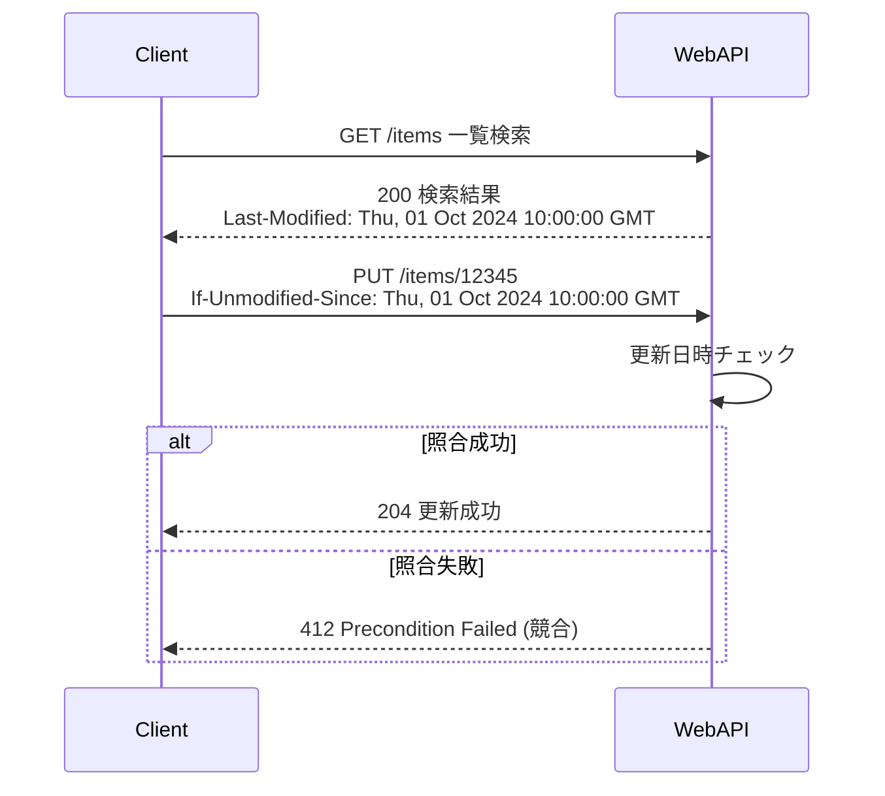

Last-Modified及びIf-Unmodified-Sinceを用いると以下の特徴がある。

- Pro
  - RESTへの適応度が高い
  - バージョン番号をDBで管理する必要がない
- Cons
  - リクエストヘッダが改ざんで、容易に上書き可能
  - バルク更新が対応不可
  - APIサーバ側が複数インスタンスから構成される場合、厳密な時刻同期がなされていないと、正確に楽観ロックできない懸念（※最終更新日をDBではなくWeb API側で取得する前提）

:::

参考:

- [REST API における楽観ロックの実装方法 \#Java \- Qiita](https://qiita.com/nannany_stores/items/c4585a2373c15d84c1d9)
- [Zalando RESTful API and Event Guidelines](https://opensource.zalando.com/restful-api-guidelines/#optimistic-locking)
- [Amazon S3が「条件付き書き込み」に対応。既にオブジェクトがある場合は上書きせず、分散アプリケーションでの利用が容易に](https://www.publickey1.jp/blog/24/amazon_s3_1.html)

<details>
<summary>UMLを開く</summary>

①If-MatchヘッダとETagヘッダ

```txt
sequenceDiagram
    participant Client
    participant WebAPI

    Client->>WebAPI: GET /items 一覧検索
    WebAPI-->>Client: 200 検索結果<br>{"items":[{"id":12345,"price":80}]}

    Client->>WebAPI: GET /items/12345 更新対象を再検索
    WebAPI-->>Client: 200 検索成功<br> ETag:"6192"<br> {"id":12345,"price":80})

    Client->>WebAPI: PUT /items/12345<br> If-Match: "6192"<br>{"price":95}
    WebAPI->>WebAPI: バージョンチェック
    alt 照合成功
        WebAPI-->>Client: 204 更新成功
    else 照合失敗
        WebAPI-->>Client: 412 Precondition Failed (競合)
    end
```

②結果エンティティにおけるETag

```txt
sequenceDiagram
    participant Client
    participant WebAPI

    Client->>WebAPI: GET /items 一覧検索
    WebAPI-->>Client: 200 検索結果<br>{"items":[{"id":12345,"price":80,"version":6192}]}

    Client->>WebAPI: PUT /items/12345<br>If-Match:6192<br>{"price":95,"version":6192}
    WebAPI->>WebAPI: バージョンチェック
    alt 照合成功
        WebAPI-->>Client: 204 更新成功
    else 照合失敗
        WebAPI-->>Client: 412 Precondition Failed (競合)
    end
```

③バージョン番号

```txt
sequenceDiagram
    participant Client
    participant WebAPI

    Client->>WebAPI: GET /items 一覧検索
    WebAPI-->>Client: 200 検索結果 <br>{"items":[{"id":12345,"price":80,"version":6192}]}

    Client->>WebAPI: PUT /items/12345<br>{"price":95,"version":6192}
    WebAPI->>WebAPI: バージョンチェック
    alt 照合成功
        WebAPI-->>Client: 204 更新成功
    else 照合失敗
        WebAPI-->>Client: 412 Precondition Failed (競合)
    end
```

</details>

# ファイル連携

## ファイルアップロード

業務システムにおいても点検結果の写真や動画、WordやPDFなど非構造データをアップロードすることがしばしば求められる。クラウド環境ではアップロードされたコンテンツは、最終的に通常オブジェクトストレージに格納することとするが、手法については以下のようにいくつかパターンがある。

| 手法                  | 説明                                                                                                         | Poc/Cons                                                                                                                                                                                                                                                                                                                                                                                                                                                                                          |
| :-------------------- | :----------------------------------------------------------------------------------------------------------- | :------------------------------------------------------------------------------------------------------------------------------------------------------------------------------------------------------------------------------------------------------------------------------------------------------------------------------------------------------------------------------------------------------------------------------------------------------------------------------------------------ |
| 1.multipart/form-data | RFC 2388でも定義された、古くから利用される方式                                                               | ✅️枯れている<br>⚠️ブラウザ以外のクライアントからは扱いにくい                                                                                                                                                                                                                                                                                                                                                                                                                                     |
| 2.Base64              | ファイルをBase64形式にエンコードして、通常のフォームデータとして送信する方法                                 | ✅️通常のリクエストボディでJSON要素の値として設定できるので楽<br>⚠️ファイルサイズが大きくなるため、モバイルなどのクライアントでは帯域の観点で懸念                                                                                                                                                                                                                                                                                                                                                 |
| 3.署名付きURL         | オブジェクトストレージで特定の期間内にのみ有効な一時的なURLを生成し、そのURLを使用してアップロードを行う方法 | ✅️負荷をクラウドサービス側にオフロードできる<br>✅️ Amazon API Gateway を利用する場合は、2023 年 6 月時点で[ペイロード上限が 10MB](https://docs.aws.amazon.com/apigateway/latest/developerguide/limits.html)、[AWS Lambda でもペイロード制限がある](https://docs.aws.amazon.com/ja_jp/lambda/latest/dg/gettingstarted-limits.html#api-requests)ため、許容するファイルサイズによってはこの手法一択となる<br>⚠️メタデータ系の登録は、別途Web APIを叩く必要があるなど、クライアント側に手続きが発生 |

本規約の推奨は以下の通り。

- サムネイルなど小さなデータの場合（数KB程度を想定）は、2.Base64の利用を推奨する
- 上記以外の場合は、3.署名付きURLを利用する

### 署名付きURLの処理フロー

署名付きURLを利用したアップロードの場合、その後でファイルに紐づかせるメタデータを登録する必要があります。例えば、参照可能な権限や検索用のタグなどの情報です。メタデータの登録をもって、ファイルアップロードが完了するというフローにすることが推奨です。


### 署名付きURLを利用する際の注意

注意点を下表にまとめる。

| 項目                                                         | 説明                                                                                                                                                                                                                                                                                             | 設定例                                    |
| :----------------------------------------------------------- | :----------------------------------------------------------------------------------------------------------------------------------------------------------------------------------------------------------------------------------------------------------------------------------------------- | :---------------------------------------- |
| 有効期限をなるべく短くする                                   | 署名付きURLは、そのURLを知っていれば誰でもアクセスできてしまうため、有効期限を短く設定することで、万が一漏洩した際のリスクを軽減する                                                                                                                                                             | 1～5分                                    |
| HTTPメソッドを指定する                                       | アップロードの場合はPOSTまたはPUT                                                                                                                                                                                                                                                                | POST                                      |
| 社内ネットワークからの利用に限る場合は、送信元IP制限を加える | AWS S3の場合はバケットポリシーでIP制限を行う                                                                                                                                                                                                                                                     | ー                                        |
| Content-Typeを指定する                                       | アップロードしたいファイルの拡張子が適切か判定した上で、署名付きURLを生成する                                                                                                                                                                                                                    | 例えば、.png, .jpeg, .webp などに絞るなど |
| Content-Lengthを指定する                                     | アップロードしたいファイルサイズが適切か判定した上で、署名付きURLを生成する                                                                                                                                                                                                                      | 100MBまでなど                             |
| アップロードファイルの検証                                   | ファイルの拡張子などは偽装可能であるため、コンテンツの検証を行う必要がある場合も考えられる                                                                                                                                                                                                       |                                           |
| EXIFの削除／抽出                                             | 画像データにおいて、EXIFは個人情報保護やセキュリティの観点から自動除外が望ましい                                                                                                                                                                                                                 |                                           |
| ウイルスチェック                                             | 社内向けであれば不要だと考えられがちですが、万が一不正なファイルがアップロードされた場合のリスクアセスメント結果によっては、ウィルスチェックにより軽減策を講じる必要がある。この場合はClamAVなどを用いて、オブジェクトアップロードイベントを元にチェック用のLambdaを起動させるなどの方法がある。 |                                           |

ウィルスチェックの処理フロー例を以下に示す。

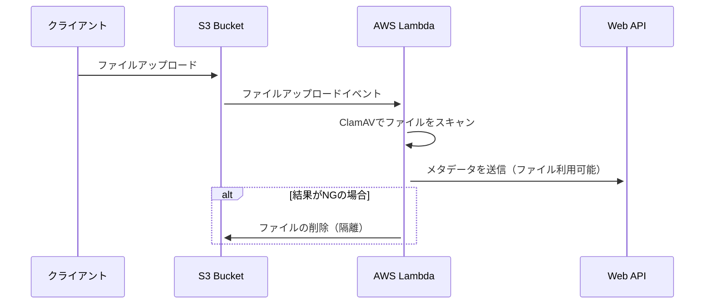

参考:

- [署名付きURLを利用したファイルアップロードWeb API設計の勘所 | フューチャー技術ブログ](https://future-architect.github.io/articles/20240705a/)
- [AWS のサーバーレスと Amazon S3 署名付き URL、クライアントサイド JavaScript で大きなサイズの複数ファイルの一括アップロード・ダウンロード機能を実現する方法 | Amazon Web Services ブログ](https://aws.amazon.com/jp/blogs/news/large-size-files-transferring-by-serverless-s3presignedurl-and-clientside-javascript/)
- [S3 バケットを AWS Lambda を使って、ウィルススキャンしてみた | DevelopersIO](https://dev.classmethod.jp/articles/s3-bucket-antivirus-lambda/)
- [S3のメタデータを用いた攻撃](https://zenn.dev/p0n/articles/3a6139cce9fa17)

## ファイルダウンロード

ファイルアップロードと同様、ファイルダウンロードの推奨は以下の通り。

- サムネイルなど小さなデータの場合（数KB程度を想定）は、Base64でエンコードし、JSON項目の値に設定して返す
  - この場合は、URIでそのままimageタグに埋め込めるようにデータURIスキームで返す
  - 例えば、`` srcに設定されるような形式である
- 上記以外の場合は、署名付きURLを利用してダウンロード

### 署名付きURLの処理フロー

署名付きURLを利用したファイルダウンロードの例を示す。

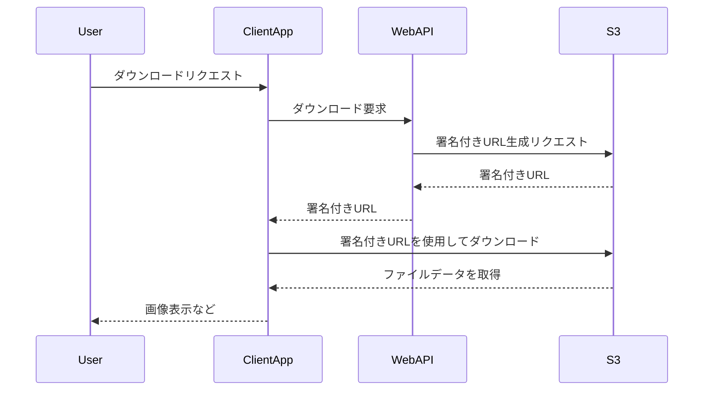

なお、画像参照のようにユーザー権限でダウンロードを絞り込む必要がなく、ログイン済みユーザーに対して一律参照を許容する場合は、CDN（CloudFront）を利用する構成案もある。CloudFront（CDN）は、ログイン済みユーザ（Cookieを持ったユーザ）だけに参照を許可できるためである。この場合は、署名付きURLの参照を行わなくても済む。

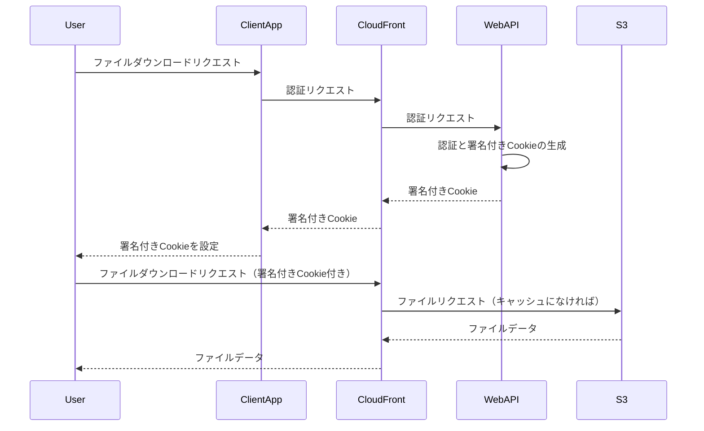

参考:

- [ファイルダウンロード完全マスター | フューチャー技術ブログ](https://future-architect.github.io/articles/20220621a/)
- [CloudFrontの署名付きCookieでプライベートコンテンツの配信 | DevelopersIO](https://dev.classmethod.jp/articles/cloudfront-signed-cookie/)

# 非同期

同期APIがレスポンスでデータやサービスを即座に提供するのに対し、非同期APIはそれらが準備でき次第、要求側にコールバックをする処理方式である。

それぞれのメリット/デメリットは以下のとおり。

|            | 同期API                                                                                                                                 | 非同期API                                                                                                                                             |
| :--------- | :-------------------------------------------------------------------------------------------------------------------------------------- | :---------------------------------------------------------------------------------------------------------------------------------------------------- |
| メリット   | ・各言語でデファクトスタンダードとなる実装があり、比較的低コストで実装可能                                                              | ・重量級の処理の場合、呼び出し側がブロックされず快適ななUX提供につながる ・アプリケーションの機能とリソースが新しいリクエストの処理のために解放される |
| デメリット | ・完了するまで呼び出し側処理がブロックされる ・応答時間が各サービスの応答時間の合算になるなど、ユーザーの待機時間が長くなる可能性がある | ・非同期タスクが失敗した場合の考慮など、設計／実装コストが高い                                                                                        |

同期APIと非同期APIの選択における本規約の推奨は以下。

- 基本的には同期APIを選択する
  - 非同期APIは使用するクライアントが発生する度にクライアント側に高コストな実装を要求することになるので、不要なケースでは使用しない
- 以下のケースで非同期APIの選択を検討する
  - 接続性が不足していたり、過飽和状態の場合
  - 処理に数分以上かかるなど、レイテンシが大きくなりすぎる場合

## 非同期タスクの完了通知方式

非同期処理の設計パターンとして、非同期タスクの完了時の通知をどのように行うかで下表の2パターンが存在する。

|            | ①ポーリング方式                                                                                                                                                                                                                                                                                                                                                                                                                                                                                                                                                                                                                                                                                                                                                                                                                                                                                                                                                                                                                                                                                                                                                                                                                                                                                                                                                                                                                                                                                                                                                                                                                                                                                                                                                                                                                                                | ②ブロッキング方式（サーバプッシュ方式）                                                                                                                                                                                                                                                                                                                                                                                                                                                                                                                                                                                                                                                                                                                                                                                                                                                                                                                                                                                                                                                                                                                                                                                                                                                                                                                                                                                                                                                                                                                                                                                                                                                                                                                                                    |
| :--------- | :------------------------------------------------------------------------------------------------------------------------------------------------------------------------------------------------------------------------------------------------------------------------------------------------------------------------------------------------------------------------------------------------------------------------------------------------------------------------------------------------------------------------------------------------------------------------------------------------------------------------------------------------------------------------------------------------------------------------------------------------------------------------------------------------------------------------------------------------------------------------------------------------------------------------------------------------------------------------------------------------------------------------------------------------------------------------------------------------------------------------------------------------------------------------------------------------------------------------------------------------------------------------------------------------------------------------------------------------------------------------------------------------------------------------------------------------------------------------------------------------------------------------------------------------------------------------------------------------------------------------------------------------------------------------------------------------------------------------------------------------------------------------------------------------------------------------------------------------------------- | :----------------------------------------------------------------------------------------------------------------------------------------------------------------------------------------------------------------------------------------------------------------------------------------------------------------------------------------------------------------------------------------------------------------------------------------------------------------------------------------------------------------------------------------------------------------------------------------------------------------------------------------------------------------------------------------------------------------------------------------------------------------------------------------------------------------------------------------------------------------------------------------------------------------------------------------------------------------------------------------------------------------------------------------------------------------------------------------------------------------------------------------------------------------------------------------------------------------------------------------------------------------------------------------------------------------------------------------------------------------------------------------------------------------------------------------------------------------------------------------------------------------------------------------------------------------------------------------------------------------------------------------------------------------------------------------------------------------------------------------------------------------------------------------- |
| 説明       | 非同期タスクの終了まで、クライアントがポーリングで結果取得を繰り返す                                                                                                                                                                                                                                                                                                                                                                                                                                                                                                                                                                                                                                                                                                                                                                                                                                                                                                                                                                                                                                                                                                                                                                                                                                                                                                                                                                                                                                                                                                                                                                                                                                                                                                                                                                                           | 非同期タスク終了後、サーバ側から結果を通知する                                                                                                                                                                                                                                                                                                                                                                                                                                                                                                                                                                                                                                                                                                                                                                                                                                                                                                                                                                                                                                                                                                                                                                                                                                                                                                                                                                                                                                                                                                                                                                                                                                                                                                                                             |
| フロー図   | [](https://mermaid.live/edit#pako:eNqtVFtrE0EU_ivDPLekRn1ZpNAakeKlxVYKshAmu5N0dbOzzswqJQTcXW0rSWlQm1q11hctisZbi9h6-S9ONzH_wtlubk1SSMCwD5kz53znfN-3e3JQIzqGCmT4toMtDScMlKEoq1pA_mxEuaEZNrI4OG8a2OK98XmcmpiZ6o0nJntjE2zR0uYQu6Va0WUEOjo-HqEoYGZ6dg7EKLYJ5SzGkIlZElnIXGQGi0qiTFnSAlNAfetlUCpWX2wL77fwvgvvowL-7n0LCuvnUnT8z70D4X0Q_mvh_xDeo9pesfbks3A3hVcIXu0GpRXhecL15LGrQ2JSASpEmoZtjnUVHruW99H0CoiPxcFEIytsmFPhTZKakhVh_an46TNnVTgi_zKOuMOicBs231TjKuEYkDuYgoG41cuFYKcxc6tgtDG3YSVtSjIUMzYkeHXTq5cfC7co3EL4SJWW39RKS8KtNDtGiCYhNpghpmlYGZAmFHCJCTSStU3MDdLI6mvzxQsnuhyLRIpFsrUgjpkSjuovHdkZjh2sebUHO-3cxGRHqx4hTvJwDExfGti9TtTQwBAUW_rQTgaV4uH-UreHfVlWn-9Wy5_CCRsSY_3Ez2g4fQfVVura0aNjiv8iaRuv_UUMRawfo2ad8N8Lfytk5a8Ea-Xg10Y4V-3nl6C0enjwVLir169dFu474b6V73nV_xpUng3ESyd3LZMgPelQU_JQYfXhunDvB8v7wt0Q7nZXiyNucARmMc0iQ5eLNxe2USFfwFkcCaHjNHJMHu6bvExFDiez8s2ACqcOHoGUOJkFqKSRyeTJsXXEm1u7FZXb9gYh7TPWDU7olWjVH238_D-jXldr) | [](https://mermaid.live/edit#pako:eNqVVP1P00AY_lcu9_PIEPWXxpBsDs0iAnEzRtNkOdpjVLpevbtiyLLEdjo0g0hiGIriflKCMWj8iBEV_5ijxf0XXnfbgE0Ma5p-vJ_3PM-btwwNYmKoQYbvedgxcMZCRYpKugPk5SLKLcNykcPBZdvCDh-038KzqZnsoD2THrSl2JJj5BFb0B3lVEVHxsdVFQ3MTOfyIEmxSyhnSYZszArIQfYSs5hKUZEyJZPWADIM7HJsnnBJn6qrgbHRMZDqxFyapeNlHd4ls1lThxrQ4bmx8xcu6jAhPxlH3GPK3CsKK30te-fXQGvrdbi2Er1qiuC3CL6L4IMG_nz9FtbXu9imCMeALGIKzpTWatTD7bpK7SV0YMaR1Zqo_lRZ0csvUeOjBiyn4FJSpJixoZtGL4JW45nwV4Rfj--gHi6_PVyrCX-3e5JTJJLvHDEWME_mMI075aQfTCzKZ0zx1YlTBUwqlpOKd6dftBjpZDaXn5gCUqRCR5I-WN1T_AtT68HmYfNNG1MgAQl_X_jb4f6jaKc5ND_h7srBXm0oOQxScm3cm8ZMeuQYa1PT-eyV2yeAnT60o2D6Wmdcjw_mUYPuZA6I8z_2O7SfmOhunqi-F9WtGFL1cfi0Ee5vxP0Pf30K11YPfjwX_urNG5PCfyf8HTkhUfVzuLt5pvOb5L5jE2QWPGpLFDqMnqwL_2G4vCf8DeE3-1q0kcEELGFaQpYpF1M5bqNDPo9LWNFg4jnk2VyHulORocjjJCcFghqnHk5ASrziPNTmkM3kn-eaiHe3Ws8qt9EdQo7-sWlxQq-rVdjeiJW_KjcQ-g) |
| 実装難易度 | ✅️クライアントからポーリングする点は、同期APIの組み合わせであるためサーバ側としての実装パターンを増やさなくても住む                                                                                                                                                                                                                                                                                                                                                                                                                                                                                                                                                                                                                                                                                                                                                                                                                                                                                                                                                                                                                                                                                                                                                                                                                                                                                                                                                                                                                                                                                                                                                                                                                                                                                                                                           | ⚠️Server Sent Events（SSE）Web Socketなどの仕組みと組み合わせる必要がある。ロードバランサーなどのタイムアウト時に再接続が必要など、考慮点もいくつか追加される                                                                                                                                                                                                                                                                                                                                                                                                                                                                                                                                                                                                                                                                                                                                                                                                                                                                                                                                                                                                                                                                                                                                                                                                                                                                                                                                                                                                                                                                                                                                                                                                                              |
| 進捗       | ✅️非同期タスク側がステータスを書き込めば進捗を返すことが可能                                                                                                                                                                                                                                                                                                                                                                                                                                                                                                                                                                                                                                                                                                                                                                                                                                                                                                                                                                                                                                                                                                                                                                                                                                                                                                                                                                                                                                                                                                                                                                                                                                                                                                                                                                                                  | ✅️非同期タスク側がステータスを書き込めば進捗を返すことが可能                                                                                                                                                                                                                                                                                                                                                                                                                                                                                                                                                                                                                                                                                                                                                                                                                                                                                                                                                                                                                                                                                                                                                                                                                                                                                                                                                                                                                                                                                                                                                                                                                                                                                                                              |
| 即時性     | ⚠️ポーリング間隔分、遅延が発生                                                                                                                                                                                                                                                                                                                                                                                                                                                                                                                                                                                                                                                                                                                                                                                                                                                                                                                                                                                                                                                                                                                                                                                                                                                                                                                                                                                                                                                                                                                                                                                                                                                                                                                                                                                                                                 | ✅️イベント駆動の組み合わせで対応可能                                                                                                                                                                                                                                                                                                                                                                                                                                                                                                                                                                                                                                                                                                                                                                                                                                                                                                                                                                                                                                                                                                                                                                                                                                                                                                                                                                                                                                                                                                                                                                                                                                                                                                                                                      |
| リソース   | ✅️分散しやすい                                                                                                                                                                                                                                                                                                                                                                                                                                                                                                                                                                                                                                                                                                                                                                                                                                                                                                                                                                                                                                                                                                                                                                                                                                                                                                                                                                                                                                                                                                                                                                                                                                                                                                                                                                                                                                                | ⚠️コネクションが接続し続けるため、富豪的である                                                                                                                                                                                                                                                                                                                                                                                                                                                                                                                                                                                                                                                                                                                                                                                                                                                                                                                                                                                                                                                                                                                                                                                                                                                                                                                                                                                                                                                                                                                                                                                                                                                                                                                                             |
| 接続性     | ✅️高い                                                                                                                                                                                                                                                                                                                                                                                                                                                                                                                                                                                                                                                                                                                                                                                                                                                                                                                                                                                                                                                                                                                                                                                                                                                                                                                                                                                                                                                                                                                                                                                                                                                                                                                                                                                                                                                        | ✅️SSEの場合高い。WebSocketの場合、企業内のプロキシなどにブロックされる可能性がわずかに上がる                                                                                                                                                                                                                                                                                                                                                                                                                                                                                                                                                                                                                                                                                                                                                                                                                                                                                                                                                                                                                                                                                                                                                                                                                                                                                                                                                                                                                                                                                                                                                                                                                                                                                              |

本規約の推奨は以下の通り。

- ポーリング方式を第一に考え、即時性などで要件を満たせない場合に、②の方式を検討す（チャットシステムでない限り、通常、そこまで即時性は求められないと想定できるので、多くの業務システムにおいて②が牛刀だと考えられる）

<details>
<summary>UML（折りたたみ）</summary>

ポーリング方式

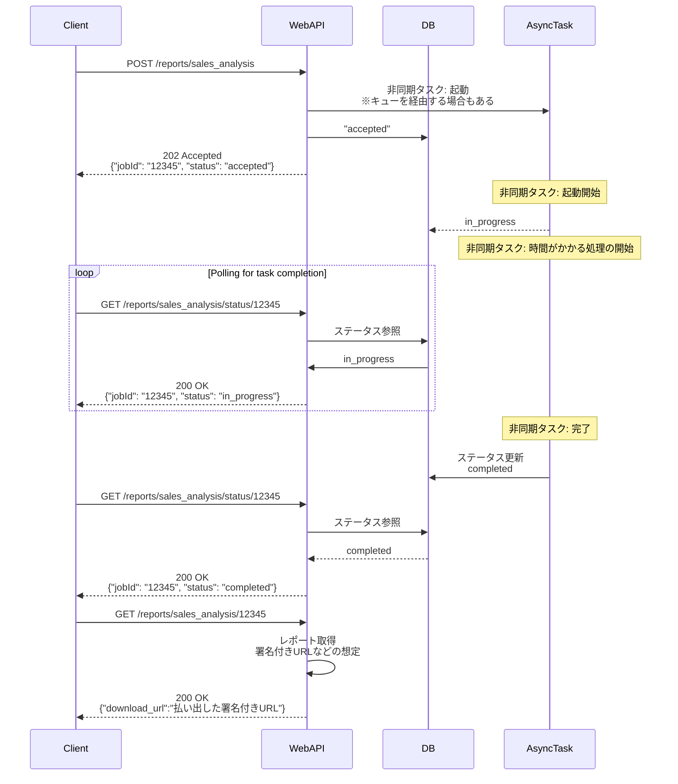

サーバプッシュ方式

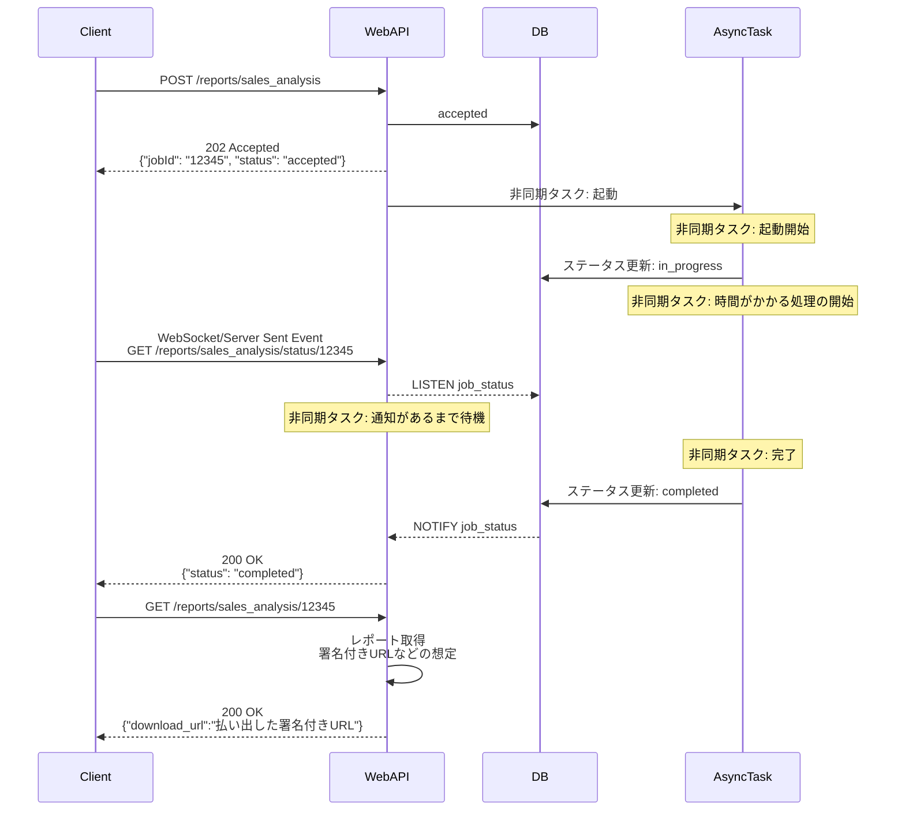

</details>

## サーバプッシュの方式

サーバプッシュの方式として、下表の3種類がよく挙げられる。

|              | ①ロングポーリング                                                                                      | ②Server Sent Event                                                                                                                             | ③WebSocket                                                                                           |
| :----------- | :----------------------------------------------------------------------------------------------------- | :--------------------------------------------------------------------------------------------------------------------------------------------- | :--------------------------------------------------------------------------------------------------- |
| 説明         | サーバー側で更新があるまで待機し、更新があったタイミングで応答。再びクライアント側から再接続してもらう | HTTPプロトコルを使用し、クライアント側からサーバへHTTPリクエストを送り、その接続を維持することで、サーバから継続的にデータをストリーム送信する | 双方向通信が可能で、サーバ／クライアント間でメッセージを送受信できる。バイナリ送信も可能で効率が良い |
| 通信方向     | 一方向                                                                                                 | 双方向                                                                                                                                         | 双方向                                                                                               |
| 即時性       | ❌️1度のやり取りでヘッダなどが付与されるためオーバーヘッドあり                                         | ⚠️高い                                                                                                                                         | ✅️最も低レイテンシ                                                                                  |
| プロキシ対応 | ✅️高い                                                                                                | ✅️高い                                                                                                                                        | ⚠️ブロックされる可能性がほかと比較すると高い                                                         |
| 接続維持     | ❌️自前実装（再接続実装）                                                                              | ✅️自動再接続機能がある                                                                                                                        | ⚠️クライアント側で再接続ロジックを実装                                                               |
| 保守運用性   | ⚠️古い手法である                                                                                       | ✅️比較的低い                                                                                                                                  | ⚠️WebSocketの扱いをサーバ／クライアントで慣れる必要がある                                            |

本規約の推奨は以下の通り。

- サーバプッシュがもし必要な場合は、非同期完了通知の目的であれば②Server Sent Eventを採用する

## 非同期タスクのキャンセル

非同期タスクの起動要求時は、疎結合化／流量調整などを目的として、Amazon SQSのようなキューイングサービスを経由させることが多い。

非同期タスクのキャンセルについては、状況別に以下の対応が考えられる。

| 状況                   | キャンセル時対応                                                                                                                                                                                                                                                                                                                                                              |
| :--------------------- | :---------------------------------------------------------------------------------------------------------------------------------------------------------------------------------------------------------------------------------------------------------------------------------------------------------------------------------------------------------------------------- |
| 非同期タスクが未起動   | キャンセル要求を受付時に、DBにキャンセルステータスを書き込む。 非同期タスク起動時に、DBを参照しメッセージIDがキャンセル済みかどうか判定。キャンセルの場合は起動をスキップする                                                                                                                                                                                                 |
| 非同期タスクが起動済み | キャンセル要求を受付時に停止できないか試みる。非同期タスクがどのような形式で稼働しているかで、対応可否が変わる。 1.ECSジョブが起動する場合は、ecs stop-task相当の処理で対象のコンテナアプリを停止させる 2.StepFunctionsジョブが起動している場合、stepfunctions stop-execution相当の処理で対象のステートマシンを停止させる 3.常駐サービスのECSの場合、おそらく停止は困難である |

## 非同期タスクの予約

時間指定で非同期タスクを登録する場合は、DBにスケジュール情報を登録し、一定間隔でスケジュールテーブルを参照し、起動要求を満たしたれコードがあれば、非同期タスクを起動させる（※正確にはキューイングサービスにエンキューすることが多い）方式を取ることが多い。

以下の処理フローのイメージを示す。

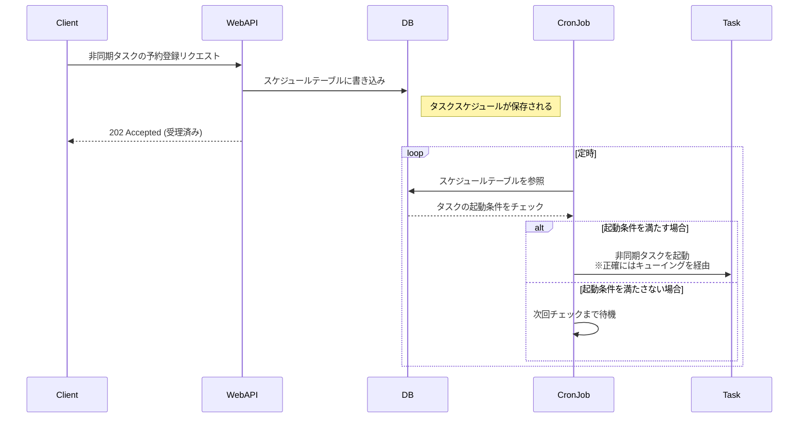

# オブザーバビリティ

## 監視と通知

### ログ監視

ログ監視は、WARN以上を通知対象とするなどのルールを設定する。WARN／ERRORレベルの差は、N営業日以内に解決すべきことか、即日リカバリが必要かなどの区別で定義する。

#### 400番台

一般的に、400番台のエラーはクライアント起因のエラーであるため、INFOレベルでログ出力し通知対象外とすることが多い。

ただし、画面とWeb APIを一体的に構築しており、クライアント側でバリデーションを設けており通常、サーバサイドで400エラーが発生しない想定であれば、サーバサイドのバリデーションエラーは何かしらの実装不備である可能性が高く、状況を把握するためにWARNログを出す運用も考えられる。

本規約の推奨は以下の通り。

- 400系のエラーはINFOログ出力で良い
- プライベートAPIかつ、画面と一体的に開発している場合には、バリデーションエラーはWARNログを出して、状況把握に務める

#### 500番台

サーバ内でリトライを組み込んでいる前提だが、それでも発生するDBや他のWeb APIへの接続失敗や、実装不備（例えば、SQLクエリとスキーマの不一致が原因）などで発生する。

本規約の推奨は以下の通り。

- 実装不備が起因の場合、エラーログを出力する
- プライベートAPIで、サービスが小さい場合において、DBや外部サービスへの通信エラーが起因となる500を返す場合、エラーログを出力する
  - ユーザーに何かおかしい不具合を返したのであれば、開発者側でも状況を把握しておき、必要なアクションをすべきである
- 前段のALBやAPI Gatewayによるタイムアウトがある場合、それに合わせてアプリケーション側でもタイムアウトログをWARNレベル出す（参考: [Lambda コンテキストオブジェクトを使用して Go 関数の情報を取得する](https://docs.aws.amazon.com/ja_jp/lambda/latest/dg/golang-context.html#golang-context-access)）

サービスが成長し、例えば常時数百～数千\[TPS\]のリクエストがあるWeb APIだと、1件1件のエラーについて調査を行うと、必要な開発が滞ってしまい全体最適な投資が行いにくくなるという懸念もある。このような場合は、SLI／SLOという考えを導入し、どのくらいの割合まで500エラーを許容するかといったエラーバジェットを検討する。

### メトリクス監視

本規約の推奨は以下の通り。

- Web APIサーバについてはCPU、メモリ使用率、ストレージ監視する必要はない（オートスケールさせる想定のため）
- ヘルスチェックなど外形監視を利用する

## トレースIDをどこで払い出すべきか

クライアント／サーバサイドのどちらでトレースIDを発行すべきか悩む場合がある。

| 観点               | ①クライアント側生成                                                   | ②サーバサイド側生成                                                                              |
| :----------------- | :-------------------------------------------------------------------- | :----------------------------------------------------------------------------------------------- |
| 生成タイミング     | マウスクリックなどのイベント単位（または、Web API呼び出しタイミング） | API呼び出し時                                                                                    |
| トレースの一貫性   | ✅️                                                                   | ⚠️APIゲートウェイや、Web API内部のミドルウェア（Servlet Filterなどの層）で実施することで緩和可能 |
| トレースIDの信頼性 | ❌️改ざんに弱い                                                       | ✅️信頼できる                                                                                    |

本規約の推奨は以下。

- 業務アプリケーション開発など、クライアント側のアプリケーションの統制を行えるのであれば、①クライアント側でトレースIDを生成する

::: tip エラー問い合わせの自動化  
サーバー問い合わせの結果がNGだった場合のエラー表示で、トレースIDがあれば便利である。もし、ユーザー自身に問い合わせを行わせるのであれば、トレースIDの桁数は7桁など郵便番号程度に抑えることが望ましい。トレースIDは重複しても調査時に大きな障害にならないためである。

エラー問い合わせを自動化する場合は、画面のスクリーンショット／問い合わせAPIの呼び出しまで行えると良い。監視サービスの中にはDOM情報も収集する機能を持つものもある。  
:::

## ヘルスチェック

ヘルスチェックによく用いられるURLは以下のような例がある。

- `/health` （★推奨）
- `/healthcheck`
- `/status`
- `/ping`
- `/heartbeat`
- `/healthz` （★推奨2）

本規約での推奨は以下の通り。

- プロセスの生存確認は `/health` を用いる
- 依存しているDBや他のマイクロサービスを含めての動作確認は `/healthz` を用いる

なお、Kubernetes上の、`Liveness Probe` `Readiness Probe` 目的の場合はそれぞれ `/live`、`/ready` を作成すること。

また、ヘルスチェックのRFCは、Informational（標準化トラックではないが有用な情報）を目指してDraftが作られていたが、2020年4月に失効している。

- [Health Check Response Format for HTTP APIs](https://inadarei.github.io/rfc-healthcheck/)

::: tip  
「バージョニング方式」章の推奨を含めると、 `/v1/health` になると考えられる。また、静的コンテンツを同一ドメインで配信するのであれば、 `/api/v1/health` になると考えられる。  
:::

::: tip ヘルスチェックのアクセスログについて  
ヘルスチェックに対するアクセスログは除外するような分岐を入れた方が良い。ヘルスチェックAPIはロードバランサーなどシステム内部側で利用されるため、ログを出力すると調査分析の妨げになるし、余計なキャッシュアウトにも繋がるためである。  
:::

参考: [多様なプロダクトが存在する freee における health check 標準化](https://developers.freee.co.jp/entry/Health-Check-Standardization-in-Diverse-freee-Products)

# ロギング

Web APIアクセスに対して適切にログ出力することで、何かしらの不具合検知やセキュリティインシデントの調査などに役立てることができる。ログ全体の推奨は以下。

- ログレイアウトはJSON Linesを利用する

本節では、アクセスログ、アプリケーションログ、監査ログについて説明する。

## アクセスログ

アクセスログは、システムに対するリクエストの記録である。

### 出力タイミング

アクセスログには、以下の設計パターンが存在する。

1. リクエストが届いた瞬間に出力
2. レスポンス後に出力
3. 1,2の両方で出力

本規約の推奨は以下の通り。

- 3の両方で出力。リクエストとレスポンスの両方を出すことで、調査性を上げる。ログ量は倍になるが、保守運用性を高めることを優先する

### ログ項目

「ヘルスチェック」の章に記載の通り、ヘルスチェックのアクセス時はログ出力はさせない。

標準的な項目については下表に従う。表に存在しない場合、任意の項目を追加して良い。

| 項目             | 項目       | 要求 時必須 | 応答時 必須 | 形式                                                                                                                |
| :--------------- | :--------- | :---------- | :---------- | :------------------------------------------------------------------------------------------------------------------ |
| タイムスタンプ   | timestamp  | ✅️         | ✅️         | ISO 8601形式でミリ秒まで保持する。タイムゾーンはUTCまたはJST 2024-10-12T11:23:01.123Z 2024-10-12T20:23:01.123+09:00 |
| ログレベル       | level      | ✅️         | ✅️         | info固定または、要求時をdebug・応答時にinfoにしても良い                                                             |
| ユーザーID       | user_id    | ❓️         | ❓️         | ログイン済みの場合、ユーザーIDを出力する                                                                            |
| リクエストID     | request_id | ✅️         | ✅️         | トレース用のID。リクエストヘッダーに存在する場合はそれを、存在しなければサーバ側で採番した値を出力                  |
| URLパス          | url        | ✅️         | ✅️         | 相対パス。 `/api/v1/users`                                                                                          |
| HTTPメソッド     | method     | ✅️         | ✅️         | HEAD,GET,POST,PUT,PATCH,DELETE                                                                                      |
| 送信元IPアドレス | ip_addr    | ❓️         | ❓️         | パブリックAPIの場合、個人情報特定に繋がる可能性があるため、扱いはよく検討する                                       |
| ステータスコード | status     | ー          | ✅️         |                                                                                                                     |
| 処理時間         | term       | ー          | ✅️         |                                                                                                                     |

::: tip OPTIONSのログは出すべきか？  
「機能配置」章に記載した通り、CORS対応のためのOPTIONSメソッドはAPIゲートウェイなどで対応させることが推奨である。もし、アプリケーション側でOPTIONSメソッドを実装する場合は、トラブルシューティングやセキュリティ上の監視に役立つため、特にHTTPメソッドで絞らずそのままログを出しておく方が良い。  
:::

## アプリケーションログ

標準的な項目については下表に従う。表に存在しない場合、任意の項目を追加して良い。

| 項目             | 項目         | 必須 | 形式                                                                          |
| :--------------- | :----------- | :--- | :---------------------------------------------------------------------------- |
| タイムスタンプ   | timestamp    | ✅️  | ISO 8601形式でミリ秒まで保持する。タイムゾーンはUTCまたはJST                  |
| ログレベル       | level        | ✅️  | RFC 5424に準拠したレベルを設定する。debug,info,warn,error,fatalなどを設定する |
| ユーザーID       | user_id      |      | ログイン済みの場合、ユーザーIDを出力する                                      |
| リクエストID     | request_id   | ✅️  | トレース用のID。リクエストIDやトランザクションIDとも呼ぶ                      |
| メッセージコード | message_code |      | メッセージコードを採番し、運用手順書と紐づく形とする想定である                |
| メッセージ       | message      | ✅️  | ログメッセージ（エラー時は再現情報があるとベター）                            |

### 除外すべき項目

以下の項目は、ログを保管する場所よりもセキュアに扱わなければならないため、ログ出力すべきではない。どうしても出力する必要がある場合はマスキングを検討する。

- セッションID
- アクセストークン
- 個人情報（PII）。顧客名、住所、電話番号、メールアドレス、銀行口座番号、クレジットカード番号、ヘルスケア情報などを含む
- 認証パスワード、外部接続情報
- ユーザーが収集に同意していない情報（GDPRなど）

## 監査ログ

監査ログはシステムで発生した「だれが、いつ、どのような操作をして、どうなったか」を記録する。基本的にはアクセスログの応答側に近いが、監査要件に合わせて項目は調整すること。例えば、以下のような項目の出力が必要な場合がある。

- 操作（更新／削除）前の値
  - 例: ` {"username": "old_user", "email": "[old_email@example.com](mailto:old_email@example.com)"}`
  - PIIなどセンシティブな情報の出力には注意する
- 操作後の値
  - 例: ` {"username": "new_user", "email": "[new_email@example.com](mailto:new_email@example.com)"}`
  - PIIなどセンシティブな情報の出力には注意する

参考:

- [OWASP/CheatSheetSeries](https://github.com/OWASP/CheatSheetSeries)の[cheatsheets/Logging_Cheat_Sheet.md](https://github.com/OWASP/CheatSheetSeries/blob/master/cheatsheets/Logging_Cheat_Sheet.md)

# 性能

## ページング

REST APIのページングとは、データを分割してクライアントに返す仕組みを指す。主に次のようなケースで必要となる。

- データ量が多く一度に全データを返却するとサーバやクライアントの負荷が高くなる場合
  - 数百万件の商品リスト
  - 購入履歴など
- 新規データが次々と追加される状況でリアルタイム性を損なわずにデータを取得したい場合
  - SNSのタイムライン
  - トランザクションログ
- ユーザが全てのデータを一度に必要とするケースが稀で、多くの場合最初の数件だけが表示されれば十分な場合
  - ECにおける商品の検索結果
  - メッセージアプリにおけるチャット履歴

本規約の推奨は以下。

- 本当にページングが必要かどうかまず再検討する

特にSSKDs なAPIにおいては、API提供者がAPIクライアントを管理できる場合が多く、設計上の工夫でページングを不要にできるケースが多い。

例えば、データ量が多い状況でも、次のような場合はページングを不要とすることができる。

- 検索条件による絞り込みを強制できる場合（例. 最長1ヶ月のレンジでFROM/TOの指定が必須）
- 上限1000件など返却可能な件数を決め打ちしておき、万が一上限以上のデータが存在する場合は検索条件による絞り込みをUIとして促すことができる場合

不特定多数の利用者にAPIを提供する場合など、それでもなおページングが必要となる場合、次のような実現方式が考えられる。

| 観点                         | ①オフセット&リミット方式                                                                                                      | ②ページ番号方式                                                                        | ③カーソルベース方式                                                                                                     |
| :--------------------------- | :---------------------------------------------------------------------------------------------------------------------------- | :------------------------------------------------------------------------------------- | :---------------------------------------------------------------------------------------------------------------------- |
| 概要                         | リクエストで指定した`offset`（開始位置）と`limit`（取得件数）に基づいて、結果の一部を取得                                     | リクエストで指定した`page`と`size`などのパラメータを使用して、ページ単位でデータを取得 | 特定のカーソル値を基準に、次のデータセットを取得する。 カーソルは通常、結果セットの並び順に基づいて一意に決まる値を使用 |
| ページ番号の計算             | クライアント側で実施                                                                                                          | サーバ側で実施                                                                         | \-                                                                                                                      |
| 親和性の高いUI               | ページング                                                                                                                    | ページング                                                                             | 無限スクロール                                                                                                          |
| RDBとの親和性                | ✅️高い                                                                                                                       | ✅️高い                                                                                | ⚠️普通                                                                                                                  |
| NoSQLとの親和性              | ❌️低い                                                                                                                       | ❌️低い                                                                                | ✅️高い                                                                                                                 |
| 性能                         | ❌️必要なページにたどり着くまでに、最初からそこまでの全ての行を数える必要があるため、後のページになればなるほど応答が悪くなる | ❌️オフセット& リミット方式と同様                                                      | ✅️ページング位置に伴うオーバーヘッドはなし                                                                             |
| データの整合性               | ⚠️検索の度に歯抜けや重複が発生する可能性がある                                                                                | ⚠️とかオフセット& リミット方式と同様                                                   | ✅️ソート結果に基づいて一意に決まる値を基準とするため、重複や歯抜けは発生しない                                         |
| 特定ページへのジャンプ       | ✅️容易                                                                                                                       | ✅️容易                                                                                | ❌️困難　                                                                                                               |
| 前回取得分以降の最新差分取得 | ❌️困難                                                                                                                       | ❌️困難                                                                                | ✅️容易                                                                                                                 |

本規約の推奨は以下。

- データストアとしてRDBを前提とする場合、①オフセット&リミット方式
- NoSQL（Elasticsearchも含む）のようなデータストアを前提とする場合、③カーソルベースの方式

関連情報:

- [SQLのページネーションで COUNT(\*) OVER() を使うのは避けよう](https://raahii.me/posts/count-over-query-is-slow/)

## バッチAPI

複数のリソースに対して同時に参照／更新するバッチAPIを用意しておくことで、処理性能を上げてUXの向上に貢献できる。

本規約の推奨は以下の通り。

- 参照については、カンマ区切りで複数のIDを指定可能とする
- 登録／更新については、複数のレコードを更新できるようにバッチ処理用のエンドポイントを作成する
- URLは `POST /users/batch` など、バッチ処理であることが分かるように区別する
- リクエストボディは、 `items` の属性に配列を持つ

リクエストボディの例。

```json
{
  "items": [
    { "id": 1, "name": "商品1", "price": 100 },
    { "id": 2, "name": "商品2", "price": 200 }
  ]
}
```

エラーについては以下の方針とする。

- エラーが生じたリソースの一覧とエラーを返す
- 成功したリソースは返さない（ペイロードサイズを抑えるためと、成功分を応答する意味はないため）

## gzip圧縮

レスポンスをgzip圧縮することを推奨する。「機能配置（AWS）」の章も参考にする。

# Rate limit（レート制限）

Rate Limit（レート制限）とは、特定の時間内に許可されるリクエストの数を制限する仕組みのことである。以下のような目的がある。

1. サーバー保護
   1. 大量リクエストによりサーバの負荷増大で、障害になることを防ぐ
   2. 悪意が無くても、連携先の実装不備により大量リクエストが届くことがある
2. 公平なリソース配分
   1. 一部ユーザーがリソースを占有することを防ぐ
3. セキュリティ
   1. DDoS攻撃や、不正なアクセスを試みるボットなどからサービスを保護する
4. コスト管理
   1. 使用量に応じて課金が発生する場合に、上限を設けることで予期しないコスト増加を防ぐ

本規約の推奨は以下の通り。

- Rate limitを設ける
- Rate limitはクラウドサービス（WAFやAPI Gateway）側で行う
- マルチテナントでユーザー単位（API Key単位）で制御する場合でスクラッチで実装する場合は、以下の点を注意する
  - 正確なカウントはDB負荷が高いため、Cacheサーバの利用（定期的にWrite backでメインのDBに書き込み）方式を検討する
  - Rate limitの場合は `429 Too Many Requests` を返し、`Retry-After` ヘッダを返すこと

参考:

- [Retry-After \- HTTP | MDN](https://developer.mozilla.org/ja/docs/Web/HTTP/Headers/Retry-After)

# タイムアウト

タイムアウトを適切に設定することで、リソースの無駄遣いを防いだり、クライアントの待機時間によるストレスを軽減することができる。

本規約の推奨は以下の通り。

- アプリケーション側で、タイムアウトを実装しない（例えば、Goであればアプリケーション側でcontext.WithTimeout()でタイムアウトさせない）
- クラウドサービス側でタイムアウト設定は、基本的に最長にする
- 画面から呼び出されるWeb APIが29秒より長いなど、要件未達の場合は、該当のトレースID（リクエストID、トランザクションID）をログに出力して、後で調査可能とする
- 基本的に呼び出し元が、ユーザへのフィードバックなどの観点を含む要件に合わせて、必要に応じてキャンセルさせる思想とする
- 非同期APIで作成された、非同期タスクについてはキャンセルするユーザーがいないため、最長実行時間を決め、それに応じてタイムアウトさせる

# セキュリティ

## レスポンスヘッダ

下表のようなセキュリティ周りのヘッダが存在する。

Web APIの呼び出し結果をブラウザ上でそのまま表示することは直感的には考えにくいが、何かしらの手段で表示され悪用される可能性はゼロではない。また、安全側に一律倒すことで、セキュリティ適用を簡略化させる意図がある。

| 項目                                                                                                          | 推奨値                               | 必須 | 説明                                                                                                                                                                                                  |
| :------------------------------------------------------------------------------------------------------------ | :----------------------------------- | :--- | :---------------------------------------------------------------------------------------------------------------------------------------------------------------------------------------------------- |
| [Content-Security-Policy](https://developer.mozilla.org/ja/docs/Web/HTTP/CSP)                                 | default-src 'none';                  | ✔   | CSP。クロスサイトスクリプティング（XSS）の緩和策。どのソースからコンテンツをロードするかを制限する。default-src: ‘none’ で、全リソースの読み込みを不可とする                                          |
| [X-Content-Type-Options](https://developer.mozilla.org/ja/docs/Web/HTTP/Headers/X-Content-Type-Options)       | nosniff                              | ✔   | ブラウザがMIMEタイプを自動判別することを防ぎ、特定のタイプのファイルのみを扱うようにすることで、コンテンツの解析やインジェクション攻撃を防止する                                                      |
| [Strict-Transport-Security](https://developer.mozilla.org/ja/docs/Web/HTTP/Headers/Strict-Transport-Security) | `max-age=63072000; includeSubDomains | ✔   | HSTS。HTTP Strict Transport Securityを有効にし、HTTPSを強制させ、中間者攻撃（MITM）を緩和する。[HSTS preload list](https://hstspreload.org) に記載があるように、最終的には2年間とすることが推奨である |

参考:

- [API-Security-Checklist/README-ja.md at master](https://github.com/shieldfy/API-Security-Checklist/blob/master/README-ja.md)
- [Strict-Transport-Security ヘッダーの max-age は 2 年が推奨](https://til.agile.esm.co.jp/posts/recommended-max-age-for-hsts-headers/)

::: tip 廃止になったオプション  
[X-XSS-Protection](https://developer.mozilla.org/ja/docs/Web/HTTP/Headers/X-XSS-Protection) や [X-Frame-Options](https://developer.mozilla.org/ja/docs/Web/HTTP/Headers/X-Frame-Options) などContent-Security-Policyの登場で非推奨となったヘッダも多い。  
:::

# 認証

## システム間連携時のネットワークレベルの制御

対向システムからのバッチ処理などで、自システム側のWeb APIを公開する要件があるとする。

本規約のネットワーク関係での推奨は以下の通り。

- 可能であれば送信元IPで絞る（AWSのいうSecurity Groupを適切に設定する）

## システム間連携の認証フロー

対向システムからのバッチ処理などで、自システム側のWeb APIを公開する要件があるとする。Web APIの認証方式には以下が考えられる。1, 2, 3それぞれ別の技術であるため組み合わせることも可能だが、対応コストがそれぞれあるためどれか1つ選択する前提とする（無認証は許容しないポリシーであるとする）。

|                      | 1.APIアクセスキー                                                                  | 2.クライアントクレデンシャルフロー                                                         | 3.mTLS                                                                |
| :------------------- | :--------------------------------------------------------------------------------- | :----------------------------------------------------------------------------------------- | :-------------------------------------------------------------------- |
| 説明                 | x-apikey ヘッダでアクセスキーを連携する方式。API Gatewayが提供する機能の一部とする | 認可サーバにクライアントID、クライアントシークレットを渡し、アクセストークンを取得する方法 | TLS相互認証のことで、クライアント証明書を用いる方式                   |
| 連携先から見た容易さ | ✅️ステートレスである                                                              | ⚠️少し手順が複雑になる                                                                     | ⚠️クライアント証明書の読み込みが必須                                  |
| 処理性能             | ✅️仕組みが単純なため高い                                                          | ⚠️トークンの取得および検証分、不利と言える                                                 | ✅️大きなペナルティは無い                                             |
| セキュリティ         | ⚠️APIキー漏洩など不正利用のリスクが懸念                                            | ✅️アクセストークンには有効期限があるため、リスクが限定できる                              | ⚠️クライアント証明書の漏洩には脆弱                                    |
| 監査                 | ✅️API Gatewayの機能に依存                                                         | ✅️IdP（認証基盤）側の仕組みに寄せることが可能                                             | ⚠️個別に作り込む必要がある                                            |
| スロットリング       | ✅️大体のAPI Gatewayでアクセス数制限が可能                                         | ❌️個別実装が必要                                                                          | ❌️個別実装が必要                                                     |
| インフラリソース     | ⚠️API Gatewayが増える                                                              | ✅️既存の仕組みに相乗りできる                                                              | ⚠️相互認証のAPI Gatewayが増える                                       |
| 設計コスト           | ❌️APIキーとアクセストークンの2パターンの対応が必要                                | ✅️アクセストークン方式に統一できる                                                        | ❌️APIキーとアクセストークンの2パターンの対応が必要                   |
| 運用コスト           | ✅️                                                                                | ✅️                                                                                        | ❌️定期的に連携先に新しいクライアント証明書を配布し適用する運用が必須 |

2.クライアントクレデンシャルフローの処理例を下図に示す。

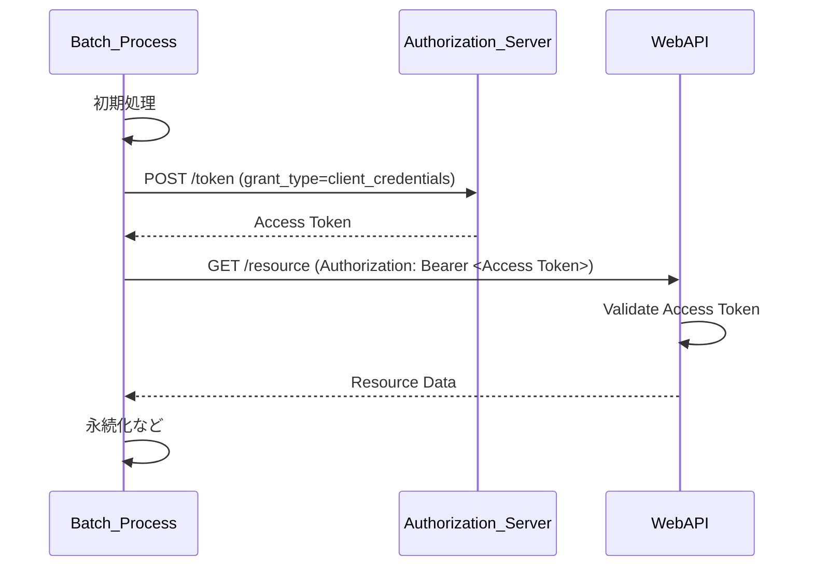

本規約の推奨は以下の通り。

- 「2.クライアントクレデンシャルフロー」を採用する
- もし、対向システム側で認可サーバのアクセスが不可の場合は、アクセスキー方式を検討する

::: tip  
自領域のシステムで稼働するバッチ処理については、Web API経由ではなく、直接DBを参照／更新すれば良い。Web APIを呼び出しによって生じるコスト増を防ぐためである。ビジネスロジックがWeb API側に存在しており、流用したいと考えている場合もあるが、しばしばバッチの性能劣化を招くことがあるため、非推奨とする。そのような場合の対応としては、ビジネスロジックを再利用可能なパッケージ化にするなどがある。  
:::

::: tip ユーザーごとにアクセス数制限を入れたい場合  
「2.クライアントクレデンシャルフロー」を採用した場合で、さらにユーザーごとにアクセス数制限を入れたい場合は、2に加えて、「1.APIアクセスキー」を追加して制御することになる。  
:::

## フロントエンド認証フロー

Auth0やEntraIDなどのIdP（Identity Provider）を利用して認証する構成で、フロントエンドからWeb APIを呼び出す場合を想定する。

本規約での推奨は以下の通り。

- Authorization Code Flow with PKCE（認可コード+PKCE）を利用する

理由:

- Implicit Flowは非推奨である（参考: [OAuth 2.0 の Implicit grant 終了のお知らせ \- r-weblife](https://ritou.hatenablog.com/entry/2018/11/12/110613)）
- Client Credentials Flowはサーバやバッチアプリケーションに向く方式であり、フロントエンド認証フローでは不適切である
- PKCE（Proof Key for Code Exchange）を認可コードフローに追加することで、セキュリティを高めることができるため

## Web API認証フロー

「フロントエンド認証フロー」によって、アクセストークンを取得できたとする。Web APIへの認証については大別して以下の2つの方式がある。

|                     | 1.ベアラートークン方式                                                                                                                                                                                                                                                                                                                                                                                                                                                                                                                                                                                                                                                                                                                                                                                                                                                                                                                                                                                                                                                                                                                                                                                                                                                                                                                                                                                                                                                                                                                                                                                                       | 2.セッショントークン方式                                                                                                                                                                                                                                                                                                                                                                                                                                                                                                                                                                                                                                                                                                                                                                                                                                                                                                                                                                                                                                                                                                                                                                                                                                                                                                                                                                                                                                                                                                                                                                                                                                                                               |
| :------------------ | :--------------------------------------------------------------------------------------------------------------------------------------------------------------------------------------------------------------------------------------------------------------------------------------------------------------------------------------------------------------------------------------------------------------------------------------------------------------------------------------------------------------------------------------------------------------------------------------------------------------------------------------------------------------------------------------------------------------------------------------------------------------------------------------------------------------------------------------------------------------------------------------------------------------------------------------------------------------------------------------------------------------------------------------------------------------------------------------------------------------------------------------------------------------------------------------------------------------------------------------------------------------------------------------------------------------------------------------------------------------------------------------------------------------------------------------------------------------------------------------------------------------------------------------------------------------------------------------------------------------------------- | :----------------------------------------------------------------------------------------------------------------------------------------------------------------------------------------------------------------------------------------------------------------------------------------------------------------------------------------------------------------------------------------------------------------------------------------------------------------------------------------------------------------------------------------------------------------------------------------------------------------------------------------------------------------------------------------------------------------------------------------------------------------------------------------------------------------------------------------------------------------------------------------------------------------------------------------------------------------------------------------------------------------------------------------------------------------------------------------------------------------------------------------------------------------------------------------------------------------------------------------------------------------------------------------------------------------------------------------------------------------------------------------------------------------------------------------------------------------------------------------------------------------------------------------------------------------------------------------------------------------------------------------------------------------------------------------------------- |
| フロー図            | [](https://mermaid.live/edit#pako:eNqFVM9rE0EU_leGOUiElt73UAithyBKIAdBFmTdTJLFZCduZhUphe6MSCKKpShUSA79gYQkbQ9BMDSlf8xLYjz1X_DNJNvWTWpvM2--9733fW9mtqjL84xatMZeh8x32abnFAOnYvuEVJ1AeK5XdXxBctk0cWrk99fzP63D5GE6p8-mnc_jL2cgf4IagtpdAGUzGvWMvdRL29fnT7lghL9hgea3SPbxxiOQfZPfABWBOgLVA9UH-Qui9ryA6oDEMm2QA1B1iE5HF81J3dRDltX19XTOIkuxJKXFvnBLTrnM_CIjD0hNOIKB3BvvdkHuPNQk6dwqkpiGYknXLXVA7YA81l0hr2ZcIFiiK0kTtRNKvxvmbyAPNLk8RL7RxSVERxD90BoRpsv1E3r-lfwfIEklWkDlxgps0St4LEgKNz0g_HxucsyLeZnN24F5CwQTZ1o3OH_loSHvQZ0YVBdUN2bpmQjOsju6bI1P9pe6dVdtNAXUPiilZ4DBqGs8j9AjvFDJayH3pgefIPpwy6NsxiKLSJJae3tnzZkveHO1PkNwZ3fR6eS4OW0P5xnxUO6DXw3ra54vAl6rMld43L8aNm6GcU_Js0mzMf44iEvG0zMiewbdMsYN6AqtsKDieHl86lsab1NRYhVmUwuXeVZwwrKwqe1vI9QJBc-9811qiSBkKzTgYbFErYJTruEurObxys__iesovvHnnN_sWd4TPHgy-1zMH7P9F53-O84) | [](https://mermaid.live/edit#pako:eNqFVF1rE0EU_SvDPkiEFt8XCcTGhyJKIA-CBMp0d5IMJjtxM6toKWRnqLSoGIJgFQO2Si1JtZYiplTpj7lNjP_CO5tNmm6ivs3cj3PPPffOrFmOcJllW3X2IGCew7KclnxaLXiE1KgvucNr1JPk16vT3-1dQusE1HfQx6C-gu6Cfgv6B6geqF3Qr0F3QB1FFoz5hGEklc9lribBMrllg3SXrZpj0jvsvOi_PAT1zQDppolMmlKZQJaFz59QyYVH8sx_yHwsY6DuCMmIwHvM2Sa5W0s3QR1HuVugQ9AfQB9ETfQg3I_BDXcssQ_qBPQmhF_Of74bbDYN5AhoMZ1O8LDJ3FySMpquOGVaqTCvxMgVUpdUMlCtfrMLqhEJksBaRPgx4bFrQrkDugHqo2GNdUyFGcD5rSeRVCsWHcLuoLcD4ZtL_aHDJjPdJEDmt4Op8wQyUpp9ODRy_x_YqXDmyRXumrMREZvhRR4Nd65kI8a4fQb4NJ7duCCCLGenDTFRgonkn5nQCC9nQvgM1Fb_bGO4F0LYGeiN_vsjVCB7A5U8P2v3P29DQ11f9dMGTOvJC7jYIqPQ1JCXhLjP2d8GN_JiAdDbBg7nj1TCbqQ4MtgzM0ysrGoNd55D-HR2pLPBJHXtUVxkanzj6lH8QRTZjt7JibVgVZlfpdzFv2LNZBQsWWZVVrBsPLqsSIOKLFgFbx1DaSBF_rHnWLb0A7Zg-SIolS27SCt1vAU1F9cn_mgmVnz794S4uDOXS-HfHv1O0Se1_gdl6Gn3) |
| 説明                | APIリクエスト毎にアクセストークンをAuthorizationヘッダに含める方式。トークンの検証はIdP側のトークンイントロスペクションを利用                                                                                                                                                                                                                                                                                                                                                                                                                                                                                                                                                                                                                                                                                                                                                                                                                                                                                                                                                                                                                                                                                                                                                                                                                                                                                                                                                                                                                                                                                                | 初回リクエストのみアクセストークンを利用し、以降はセッション管理（セッションIDをCookieに含めて送信）による認証を行う方式。セッション管理テーブルやキャッシュサーバが必要                                                                                                                                                                                                                                                                                                                                                                                                                                                                                                                                                                                                                                                                                                                                                                                                                                                                                                                                                                                                                                                                                                                                                                                                                                                                                                                                                                                                                                                                                                                               |
| 処理性能            | ❌️リクエストの度に、トークンイントロスペクションAPIで確認が必要。アクセストークンのデータサイズによっては多少不利                                                                                                                                                                                                                                                                                                                                                                                                                                                                                                                                                                                                                                                                                                                                                                                                                                                                                                                                                                                                                                                                                                                                                                                                                                                                                                                                                                                                                                                                                                           | ✅️サーバサイドのセッション管理部分の性能が求められやすい                                                                                                                                                                                                                                                                                                                                                                                                                                                                                                                                                                                                                                                                                                                                                                                                                                                                                                                                                                                                                                                                                                                                                                                                                                                                                                                                                                                                                                                                                                                                                                                                                                              |
| トークンの無効化    | ✅️IdPのリボケーションAPIで無効化が可能                                                                                                                                                                                                                                                                                                                                                                                                                                                                                                                                                                                                                                                                                                                                                                                                                                                                                                                                                                                                                                                                                                                                                                                                                                                                                                                                                                                                                                                                                                                                                                                      | ✅️容易である                                                                                                                                                                                                                                                                                                                                                                                                                                                                                                                                                                                                                                                                                                                                                                                                                                                                                                                                                                                                                                                                                                                                                                                                                                                                                                                                                                                                                                                                                                                                                                                                                                                                                          |
| 再ログイン 必須期間 | ❌️IdP側のリフレッシュトークンが無効になるタイミングに依存する。例えば、リフレッシュトークンが無操作で最大48時間までしか保持できない場合、土日を挟むと再ログインが必須になるといった懸念がある                                                                                                                                                                                                                                                                                                                                                                                                                                                                                                                                                                                                                                                                                                                                                                                                                                                                                                                                                                                                                                                                                                                                                                                                                                                                                                                                                                                                                               | ✅️任意の調整が可能                                                                                                                                                                                                                                                                                                                                                                                                                                                                                                                                                                                                                                                                                                                                                                                                                                                                                                                                                                                                                                                                                                                                                                                                                                                                                                                                                                                                                                                                                                                                                                                                                                                                                    |
| IdPとの結合度       | ⚠️アクセス毎にIdPに依存                                                                                                                                                                                                                                                                                                                                                                                                                                                                                                                                                                                                                                                                                                                                                                                                                                                                                                                                                                                                                                                                                                                                                                                                                                                                                                                                                                                                                                                                                                                                                                                                      | ✅️IdP依存箇所が最小限となる                                                                                                                                                                                                                                                                                                                                                                                                                                                                                                                                                                                                                                                                                                                                                                                                                                                                                                                                                                                                                                                                                                                                                                                                                                                                                                                                                                                                                                                                                                                                                                                                                                                                           |
| セキュリティ        | ⚠️アクセストークンをローカルストレージやCookieに保持する必要がある                                                                                                                                                                                                                                                                                                                                                                                                                                                                                                                                                                                                                                                                                                                                                                                                                                                                                                                                                                                                                                                                                                                                                                                                                                                                                                                                                                                                                                                                                                                                                           | ✅️アクセストークンはWeb API認証後に破棄可能であり、保持期間を最小化できる                                                                                                                                                                                                                                                                                                                                                                                                                                                                                                                                                                                                                                                                                                                                                                                                                                                                                                                                                                                                                                                                                                                                                                                                                                                                                                                                                                                                                                                                                                                                                                                                                             |
| curlとの相性        | ✅️比較的容易                                                                                                                                                                                                                                                                                                                                                                                                                                                                                                                                                                                                                                                                                                                                                                                                                                                                                                                                                                                                                                                                                                                                                                                                                                                                                                                                                                                                                                                                                                                                                                                                                | ⚠️少し手順が複雑                                                                                                                                                                                                                                                                                                                                                                                                                                                                                                                                                                                                                                                                                                                                                                                                                                                                                                                                                                                                                                                                                                                                                                                                                                                                                                                                                                                                                                                                                                                                                                                                                                                                                       |
| ローカル開発環境    | ✅️容易                                                                                                                                                                                                                                                                                                                                                                                                                                                                                                                                                                                                                                                                                                                                                                                                                                                                                                                                                                                                                                                                                                                                                                                                                                                                                                                                                                                                                                                                                                                                                                                                                      | ✅️容易                                                                                                                                                                                                                                                                                                                                                                                                                                                                                                                                                                                                                                                                                                                                                                                                                                                                                                                                                                                                                                                                                                                                                                                                                                                                                                                                                                                                                                                                                                                                                                                                                                                                                                |

本規約の推奨と理由は以下の通り。

- 「2.セッショントークン方式」を推奨する。特にIdPの制約で、リフレッシュトークンの有効期限が想定より短くなってしまう場合に、UX上、許容できない再ログイン操作などを強いてしまう点が大きい

参考:

- [SPA+Backend構成なWebアプリへのOIDC適用パターン \- r-weblife](https://ritou.hatenablog.com/entry/2024/10/22/153014) で記載されている、「2. BEがRSとなる場合」が本節の前提である
- [サーバーレスなユーザー認証認可の考慮事項と実践的プラクティス紹介 / slsdays-tokyo-2024 \- Speaker Deck](https://speakerdeck.com/slsops/slsdays-tokyo-2023-3cd5886a-cee0-425b-821f-f4cd3230e1e0?slide=40)
- [Token Revocation (RFC 7009)はなぜ重要か？ \#API \- Qiita](https://qiita.com/yo-tabata/items/7559a7c9069ee5c167f5)

<details>
<summary>UML（折りたたみ）</summary>

1.ベアラートークン方式

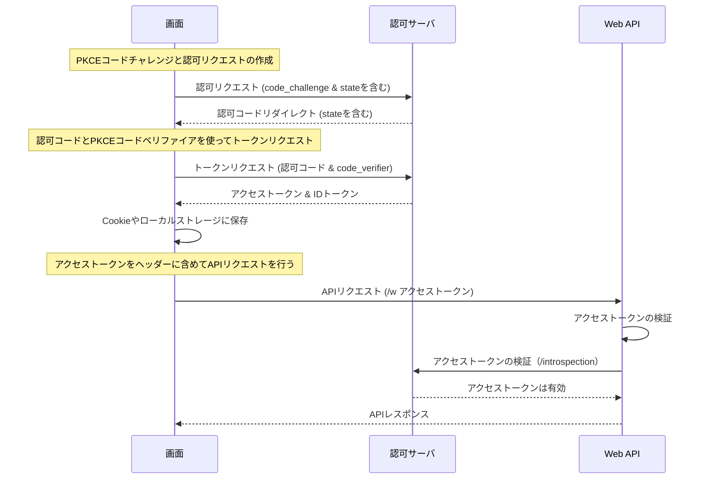

2.セッショントークン方

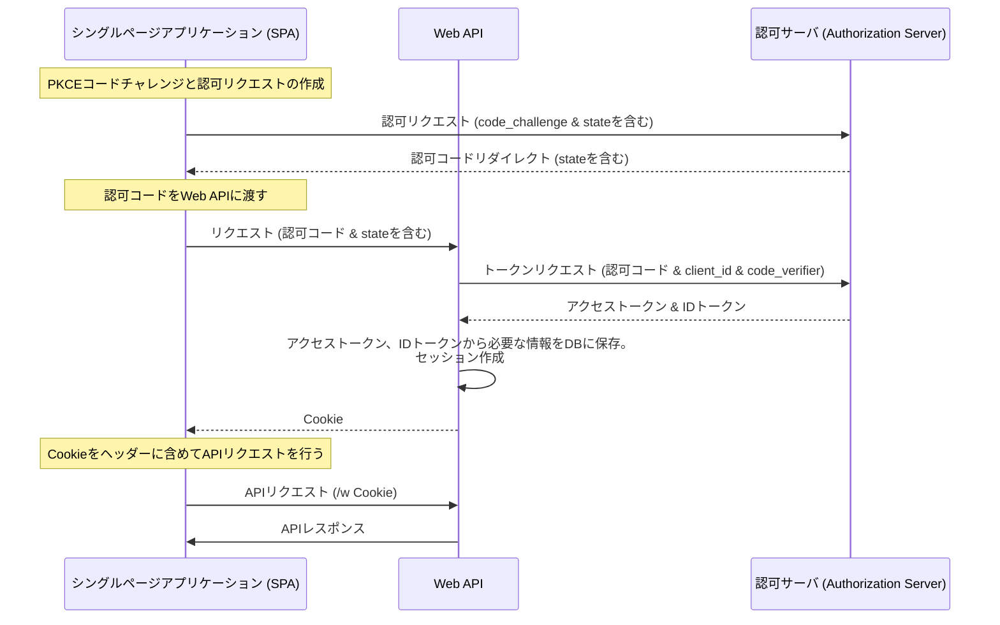

</details>

## ログアウト

ログアウトする際は、IdP側のRevoke APIでアクセストークンを無効化すべきである。  
以下に処理フローの例を示す。

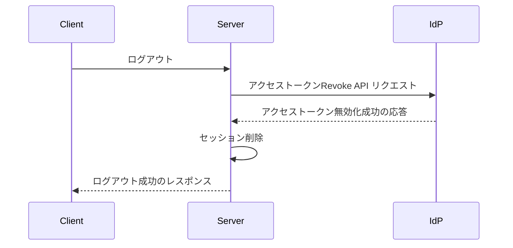

# ロール管理

ユーザーのIDとロールの紐づけを、IdP（Identity Provider）に持たせるか、アプリケーション側で持たせるかという設計判断がある。

|               | 1.IdP管理                                                                                                   | 2.アプリケーション管理                                                                  |
| :------------ | :---------------------------------------------------------------------------------------------------------- | :-------------------------------------------------------------------------------------- |
| 説明          | IdP側でユーザのアカウントと、ロールを一緒に管理する方法。IDトークンにカスタムトークンを取得できるようにする | IdPとアプリケーション側でアカウントを二重で保持し、ロールはアプリ側で紐づける方法       |
| 処理性能      | ✅️IdPサービスに機能配置を寄せられる分、負荷が低い可能性                                                    | ✅️ロール紐づけを行う処理分は不利だが、キャッシュなどで緩和可能                         |
| 拡張性        | ⚠️IdPのロールモデルがアプリケーションのニーズに適合しない場合、調整コストが高い                             | ✅️ IdPに依存することなく、アプリケーション内で一貫したロール管理とアクセス制御が行える |
| データ 整合性 | ✅️IdP側に寄せることで整合性が保ちやすい                                                                    | ⚠️IdPとアプリ側の多重管理となるため、整合性を保持する工夫が必要                         |
| 保守性        | ⚠️ロール管理について、IdPとアプリ側で切り分け対象が増えるため、学習コストが必要                             | ✅️アプリケーション側に閉じ、他の機能と大差ないメンタルモデルが適用可能                 |

本規約の推奨と理由は以下の通り。

- ロール管理は、「2.アプリケーション管理」を採用する
  - IdP側のロール管理と、アプリケーション側の要求のライフサイクルは通常異なるため、機能配置として分離する
  - 例えば、4/1の部署移動の情報更新がいつどのように反映されるかについて、アプリケーション側はビジネス領域に沿った固有の要件があるが、IdPがそれに沿ってくれるとは限らない
  - IdPは情シスにとっても重要情報であるため、アプリケーション要件に合わせて、ロールの追加や粒度変更といった対応は、頻繁に行えるとは限らないため

# CORS

CORS（オリジン間リソース共有、Cross-Origin Resource Sharing）は、追加の HTTP ヘッダーを使用して、あるオリジンで動作しているウェブアプリケーションに、異なるオリジンにある選択されたリソースへのアクセス権を与えるようブラウザーに指示するための仕組みである。

同一システム内であっても `app.example.com` `api.example.com` でサブドメインが分かれることがあり、別システム向けにWeb APIを公開しない場合も考慮が必要な場合がある。

同一システム内の対応としては、以下の考え方がある。

| 観点         | 1.同一オリジン構成                                                                                                                                                        | 2.複数オリジン構成                                                                                                                                          |
| :----------- | :------------------------------------------------------------------------------------------------------------------------------------------------------------------------ | :---------------------------------------------------------------------------------------------------------------------------------------------------------- |
| 説明         | 静的リソースとWeb APIを同一オリジンでホストし、CORSがそもそも発生しない構成にする。AWSであればLBやCloudFrontのパスベースルーティングで、S3とWeb APIを振り分ける構成にする | `app.example.com` `api.example.com` の2つのドメインでそれぞれ管理する。それぞれのシステムの独立性を高めることができる。管理するドメインが増える可能性もある |
| CORS考慮     | ✅️不要                                                                                                                                                                   | ⚠️考慮が必要                                                                                                                                                |
| インフラ構成 | ✅️パスベースのルーティングするインフラ要素が追加で必要                                                                                                                   | ✅️パスベースのルーティングの手間は不要                                                                                                                     |
| ローカル環境 | ✅️nginx などでパスベースのルーティングが追加で必要                                                                                                                       | ✅️Web API側のポート番号を含めて環境変数で切り替え                                                                                                          |

本規約の推奨は以下の通り。

- 可能であれば、同一オリジン構成を採用する

もし、複数オリジン構成（≒CORS対応が必要）な前提において、本規約の推奨は以下の通り。

- `Access-Control-Allow-Origin`
  - ワイルドカード (\*) は禁止
  - 許可するオリジンを明示的に指定する「ホワイトリスト」形式とする
  - `localhost` の追加は、開発環境のみに絞る
  - 開発／ステージング／本番などのデプロイメント環境別に、アクセス可能なドメインは絞る。環境変数などで切り替える
- `Access-Control-Allow-Headers`
  - 実際に利用するヘッダーのみ指定する
- `Access-Control-Allow-Methods`
  - 必要なメソッドのみを許可する
  - 例えば、プリフライトリクエストがPUTで来ているのであれば、PUTだけを許可することが推奨。なお、SPA画面などで基本的に全てのメソッドを返すのであれば一律許可（GET, POST, PUT, PATCH, DELETE）をしても良い
- `Access-Control-Allow-Credentials`
  - Cookieや認証ヘッダーを含める場合は、 `true` を設定する
- `Access-Control-Max-Age`
  - デフォルト値: 5 秒
  - 2019年に公開されたChromium v76 以降は最大 2 時間(7200 秒)
  - 特に設定値を変える必要はないが、チューニング観点で必要に応じて値を伸ばす

AWSの場合、API Gatewayの機能でOPTIONSメソッドを提供することが可能である。OPTIONSメソッドの実装方針は以下の通り。

| 観点               | 1.アプリケーションで実装                                            | 2.API Gatewayで実装                                             |
| :----------------- | :------------------------------------------------------------------ | :-------------------------------------------------------------- |
| 概要               | フレームワークのミドルウェアなどを活用し、OPTIONSメソッドを実装する | API GatewayのCORS機能を有効にして対応                           |
| ローカル対応       | ✅️必要                                                             | ⚠️API Gateway相当の仕組みを何かしらローカルに持たせる必要がある |
| クラウド利用費用   | ⚠️余計な通信／処理が発生                                            | ✅️API Gatewayにオフロードできる                                |
| インフラ構築コスト | ✅️複雑度は変わらない                                               | ✅️複雑度は変わらない                                           |

本規約の推奨は以下の通り。

- ローカル開発用途のため、アプリケーション側もOPTIONSメソッドを実装する
- デプロイメント環境で、API Gatewayを利用している場合はCORS機能を有効にする（API Gatewayを利用していなかれば、あえて追加する必要はない）

::: tip ローカル環境だけはNginxで同一ドメイン化する考えはどうか？  
デプロイメント環境で用いない、OPTIONSメソッドをアプリケーション側で実装することを問題視する場合に、アプリ側でCORS提供が不要になるようnginxなどリバースプロキシを配備しルーティングすることで解決を図ることがある。本規約としては、ローカル環境の構成要素を減らしたいこと、なるべくデプロイメント環境とローカル環境を一致させるポリシーを優先している。  
:::

参考:

- [オリジン間リソース共有 (CORS) \- HTTP | MDN](https://developer.mozilla.org/ja/docs/Web/HTTP/CORS)
- [CORSエラーのトラブルシューティング入門 | フューチャー技術ブログ](https://future-architect.github.io/articles/20220222a/)

# 機能配置（AWS）

Web APIにはこれ以前の章で説明したように実用のために必要とする要素が多数あるが、AWSなどのクラウドのマネージドサービスで代用できるものも多い。できる限りマネージドサービス側に寄せることで、設計開発をショートカットでき、差別化領域に集中することができる。

本規約は、下表の項目についてクラウドサービス側の機能配置とすることを推奨する。

【凡例】推奨:✅️ 条件次第で推奨:❓️

| 項目                                                               | 説明                                                                                                                                                                                                           | マネージドサービス                    |
| :----------------------------------------------------------------- | :------------------------------------------------------------------------------------------------------------------------------------------------------------------------------------------------------------- | :------------------------------------ |
| レート制限（DDoS）                                                 | 大量のAPI呼び出しのブロック                                                                                                                                                                                    | ✅️WAF                                |
| レート制限（マルチテナントで特定のユーザに寄るリソース占有の防止） | ユーザー単位（API Key単位）で制御する必要がある。要件上、マネージドサービスで実現できない場合は、「Rate limit」章を参考にする                                                                                  | ❓️API Gateway                        |
| Slow DoSなど                                                       | ペイロードを断続的に送る攻撃への対策。例えば、長大なHTTPリクエストボディ（POST ペイロード）を断続的に送ってセッションを占有する                                                                                | ❓️Amazon CloudFront ✅️WAF           |
| リクエストサイズの上限                                             | リクエストヘッダ、リクエストボディに巨大なデータを送るDDoS対応。「Large Payload Post」「HTTP爆弾」とも呼ばれる。Amazon API Gatewayはペイロードサイズの上限が制約として10MBで多少緩和できるが、通常は大きすぎる | ✅️WAF                                |
| レスポンスのgzip圧縮                                               | レスポンスのJSONをgzip圧縮することでユーザ体験を向上させる。特にモバイルの場合はユーザの通信量を抑えるメリットが大きい                                                                                         | ✅️API Gateway ✅️CloudFront どちらか |
| CORS                                                               | 「CORS」章を参照                                                                                                                                                                                               | ✅️API Gateway                        |
| SQLインジェクション/XSS 緩和策                                     | 不正な文字列の検知。ただし、アプリケーション側もSQLインジェクションについては、プレースホルダの利用、XSSについてはHTMLタグのエスケープを実装する必要                                                           | ✅️WAF                                |
| 認証／API呼び出しの認可                                            | アクセストークンやセッションのチェック。アプリケーション側のミドルウェアで実施する場合も多い。本規約では、API Gatewayを利用する場合は、Custom Authorizer側に寄せることを推奨する                               | ❓️API Gateway Custom Authorizer      |
| キャッシュ                                                         | 業務アプリであればキャッシュ可能なAPI応答は少ないため、通常使用することは少ない                                                                                                                                | ❓️API Gateway ❓️CloudFront          |

# リリース

## デプロイメント環境

Web APIの環境分離だが、クラウド環境のベストプラクティスとしては1環境、1アカウントにする方法がある。この前提であれば、デプロイメントごとの分離は、ドメイン名で識別可能とする方針が望ましい。例えば、`example.com` と `dev.example.com` などでの分離である。

「サブドメインとサブパス」で、サブパス方式を選択した前提で、ドメインで環境を識別するパターンはいくつか考えられる。

| 環境名            | ①環境上位                                                                                | ②サービス上位                                                                            | ③文字列結合                                                                              |
| :---------------- | :--------------------------------------------------------------------------------------- | :--------------------------------------------------------------------------------------- | :--------------------------------------------------------------------------------------- |
| 本番環境          | api.example.com<br>app.example.com                                                       | api.example.com<br>app.example.com                                                       | api.example.com<br>app.example.com                                                       |
| 開発環境 検証環境 | api.dev.example.com<br>app.dev.example.com<br>api.stg.example.com<br>app.stg.example.com | dev.api.example.com<br>dev.app.example.com<br>stg.api.example.com<br>stg.app.example.com | dev-api.example.com<br>dev-app.example.com<br>stg-api.example.com<br>stg-app.example.com |
| 説明              | stg, devに複数のサブドメインが存在することを考慮したパターン                             | api.example.comにサブドメインで環境を表現したパターン。 URLからどの環境か識別しやすい    | {環境名}-{サービス種別}で命名し、独立させるパターン                                      |

本規約の推奨は以下の通り。

- サブドメインで環境識別を可能とさせ、可読性から②のサービス上位を利用する

## デプロイ方式

以下のような複数のデプロイ方式がある。

1. インプレースデプロイ（一括リリース）
2. ローリングアップデート
3. ブルーグリーンデプロイメント

メンテナンスウィンドウが確保できるのであれば、1の一括リリース方式が推奨である。要件としてダウンタイムが許容できない場合は、2または3の手法を採用する。

# 参考

- [Web API 設計のベスト プラクティス \- Azure Architecture Center](https://learn.microsoft.com/ja-jp/azure/architecture/best-practices/api-design)
- [Web API 実装 \- Best practices for cloud applications](https://learn.microsoft.com/ja-jp/azure/architecture/best-practices/api-implementation)
